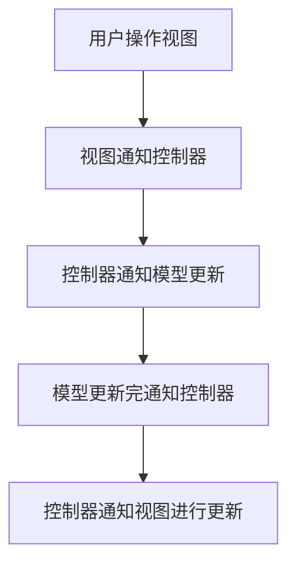
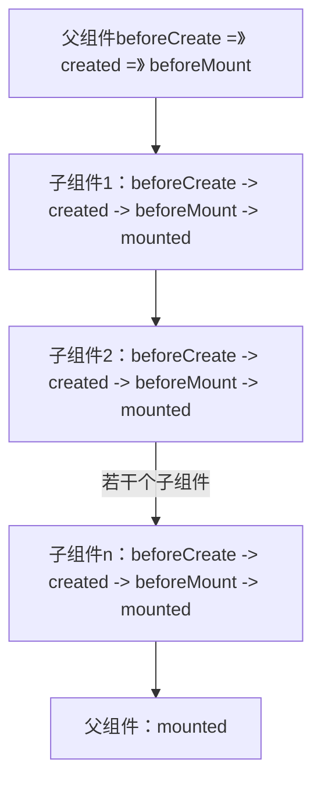

# VUE相关
## 前置
### MVVM、MVC、MVP的区别
这三者是常用的软件架构模式
#### MVC（Model-View-Controller）
主要用于分离应用程序的不同职责

**Model：** 代表应用的数据和业务逻辑，负责处理数据及其状态
**View：** 用户看到的界面，负责展示数据
**Controller：** 接收用户输入并更新Model或View的中介

**交互方式：** 用户操作视图，视图将操作传递给控制器，控制器调用模型进行数据处理，模型更新后通知控制器，控制器再更新视图
<span style='color:red'>view与Model之间没有通信，一切由Controller协调</span>

**优点：** 职责分离，提高了代码的可维护性和可测试性

**缺点：** 制图和控制器之间的耦合程度高，模型和师徒之间存在直接的交互，代码复用性差

#### MVP（Model-View-Presenter）

**Model：** 负责处理数据和业务逻辑
**View：** 负责展示数据，只负责对界面的绘制，不处理业务逻辑
**Presenter:** 作为视图与模型之间的桥梁，处理视图的逻辑，接收视图的事件并调用模型进行数据处理，将处理结果返回给试图更新

**交互方式：** 用户操作视图，视图将操作传递给展示器，展示器调用模型进行数据处理，处理完成后将结果返回给视图进行更新

**优点：** 视图和模型之间的耦合程度降低，提高了代码的可维护性和可测试性
**缺点：** 展示其中可能会包含大量的逻辑代码，使展示器变得复杂

#### MVVM（Model-View-ViewModel）——VUE的核心特性之一

**Model：** 负责处理数据和业务逻辑
**View：** 负责展示数据，通过数据绑定和视图模型进行交互
**ViewModel：** 作为视图和模型之间的桥梁，通过数据绑定和命令绑定实现视图和模型之间的**双向数据流动**

**交互方式：** 用户操作视图，视图的变化会自动更新视图模型，视图模型的更新也会自动更新视图；视图模型调用模型进行数据处理，模型更新后通知视图模型，视图模型再更新视图模型

**优点：** 视图和模型之间的耦合度进一步降低，实现了双向数据绑定，提高了开发效率和代码的可维护性；
**缺点：** 由于使用了数据绑定和视图模型，可能会增加内存开销和性能消耗

---
### 什么是组件化
将图形、非图形的各种逻辑均抽象为一个统一的概念（组件）来实现开发的模式，VUE中的每一个`.vue`文件都可以视作一个组件

**优势：**
- 降低整个系统的耦合度。在保证接口不变的情况下，可以通过切换组件完成不同需求；
- 调试方便。可以通过排除法移除组件或报错组件快速定位问题，不需要再在整个系统内查找；
- 提高可维护性。组件复用的形式使得一个组件内部的代码优化能够体征整个系统的性能。

----
### 插件是什么
插件通常用来为Vue添加全局功能，是一个具有`install`方法对象。插件的功能范围没有严格的限制，一般有下面几种：
- 添加全局方法或者属性
- 添加全局资源
- 通过全局混入来添加一些组件选项
- 添加Vue实例方法
- 一个库，提供自己的API
- ---

### 组件和插件的区别

||组件|插件|
|---|---|---|
|功能用途|用于构建用户界面，实现UI层面的复用|侧重于为Vue应用添加全局功能解决通用问题|
|使用方式|组件需要在使用处注册后使用|通过`Vue.use()`方法全局安装
|作用范围|局部，有独立的作用于和状态|全局，提供的功能在任何组件内可用|
|开发目的|组件是为了拆分页面、提高可维护性和复用性|扩展Vue功能、提供全局服务|

---

### 指令系统
指令（Directives）是带有`v-`前缀的特殊属性作用：当表达式的值改变时，将其产生的连带影响，响应式地作用于DOM

**常见的指令有：**
- 条件渲染指令：v-if
- 列表渲染指令：v-for
- 属性绑定指令：v-bind
- 事件绑定指令：v-on
- 双向数据绑定指令：v-model

<span style = 'color:red;'>自定义指令：图片懒加载</span>
```javaScript
const LazyLoad = {
    // install方法
    install(Vue,options){
    	  // 代替图片的loading图
        let defaultSrc = options.default;
        Vue.directive('lazy',{
            bind(el,binding){
                LazyLoad.init(el,binding.value,defaultSrc);
            },
            inserted(el){
                // 兼容处理
                if('IntersectionObserver' in window){
                    LazyLoad.observe(el);
                }else{
                    LazyLoad.listenerScroll(el);
                }
                
            },
        })
    },
    // 初始化
    init(el,val,def){
        // data-src 储存真实src
        el.setAttribute('data-src',val);
        // 设置src为loading图
        el.setAttribute('src',def);
    },
    // 利用IntersectionObserver监听el
    observe(el){
        let io = new IntersectionObserver(entries => {
            let realSrc = el.dataset.src;
            if(entries[0].isIntersecting){
                if(realSrc){
                    el.src = realSrc;
                    el.removeAttribute('data-src');
                }
            }
        });
        io.observe(el);
    },
    // 监听scroll事件
    listenerScroll(el){
        let handler = LazyLoad.throttle(LazyLoad.load,300);
        LazyLoad.load(el);
        window.addEventListener('scroll',() => {
            handler(el);
        });
    },
    // 加载真实图片
    load(el){
        let windowHeight = document.documentElement.clientHeight
        let elTop = el.getBoundingClientRect().top;
        let elBtm = el.getBoundingClientRect().bottom;
        let realSrc = el.dataset.src;
        if(elTop - windowHeight<0&&elBtm > 0){
            if(realSrc){
                el.src = realSrc;
                el.removeAttribute('data-src');
            }
        }
    },
    // 节流
    throttle(fn,delay){
        let timer; 
        let prevTime;
        return function(...args){
            let currTime = Date.now();
            let context = this;
            if(!prevTime) prevTime = currTime;
            clearTimeout(timer);
            
            if(currTime - prevTime > delay){
                prevTime = currTime;
                fn.apply(context,args);
                clearTimeout(timer);
                return;
            }

            timer = setTimeout(function(){
                prevTime = Date.now();
                timer = null;
                fn.apply(context,args);
            },delay);
        }
    }

}
export default LazyLoad;
```
<span style = 'color:red;'>总结：</span>
Vue的所有界面事件，都只去操作数据，所有界面的变化，都是很具数据自动绑定出来的。

----

### Vue实例挂载的过程中发生了什么

new Vue() -->
  初始化配置
  初始化生命周期
  初始化事件系统
  初始化响应式系统
  ↓
beforeCreate()
  ↓
创建响应式数据
  ↓
created()
  ↓
是否有 el / 执行 $mount
  ↓
beforeMount()
  ↓
模板编译 render
  ↓
生成虚拟 DOM 并挂载真实 DOM
  ↓
mounted()

----
### 为什么data属性是一个函数而不是一个对象
这样可以保证：<span style = 'color:red'>每个组件实例都能返回一个全新的独立的data对象，互不影响</span>
- 根实例对象data可以是对象也可以是函数（根实例是单例），不会产生数据污染的情况；
- 组件实例对象data必须为函数，防止多个组件实例之间共用一个data，产生数据污染。采用函数的形式，initData时会将其作为工厂函数返回全新的data对象。

---

## VUE 2.x

VUE2是一款渐进式JS框架，所谓渐进式，意味着可以根据项目的需求，逐步引入VUE的各种功能，而不需要一次性将整个项目重构为单页面应用。它的核心关注点是**视图层**，可以轻量地引入，也可以配合Vue Router、Vuex构建大型单页面应用，即**Vue是我们可以用数据驱动和组件化的方式构建响应式页面**

### Vue2的响应式原理

基于`Object.defineProperty`实现，对于每个响应式数据对象，都会递归遍历其所有属性，并使用`Object.defineProperty`将他们转换为getter/setter形式，当属性被访问时，getter方法会被调用，当属性被修改时，setter方法会被调用，这些方法内部会记录依赖关系，并在数据变化时通知观察者更新视图。

- Vue2使用`Object.defineProperty()`对`data`中的数据进行劫持；
- 每个数据属性通过getter/setter拦截读取与赋值；
- 借助Dep（收集依赖）和watcher实现依赖追踪以及试图更新——每个组件实例都对应watcher实例，他会在组件渲染的过程中把“接触”过的数据property记录为依赖。之后当依赖项的setter出发时，会通知watcher，从而使其关联的组件重新渲染。
---
### 动态给vue2的data添加一个新的属性时会发生什么？怎样解决？
在Vue2中直接给data中的对象新增属性，这个属性不会是响应式的，视图不会自动更新
这是因为Vue2是通过`Object.defineProperty()`实现响应式绑定的，在初始化时只能劫持已有的属性，无法监控将来新增的属性。

**解决方案：**
- 通过`vue.set()`或者`this.$set()`
- 预定义空属性
---
### Vue.observable
`Vue.observable(obj)`对对象做了响应式劫持处理，作用是将一个普通对象变为响应式对象，可以在组件外部使用(一个轻量级的vuex，)。
注：在vue3中，这个API被`reactive()`替代

---

### 组件通信

**父——>子：props方式传值**

在父组件中将需要传递的值绑定在调用的子组件上，belike：`<son :Father_data></son>`

子组件中接收并使用：

```javaScript
//非<script setup>
props:{
	Father_data:{
		type:['String','Number'],
		default:''
	}
}
```

**子——>父：$emit自定义事件**

**祖孙通信：provide&inject**

**兄弟组件通信：bus**
要传数据的组件：bus.$emit('自定事件名','数据')
接收数据的组件：bus.on('自定义事件名',回调函数)

---
### 生命周期

一般来说，系统提供了8个生命周期函数

```
beforeCreate -> created -> beforeMount -> mounted
beforeUpdate -> updated
beforeDestroy -> destroyed
```

**组件生效后，通常会执行前四个：**

`beforeCreated()`阶段什么也没有，`this.$el`/`this.$data()`均为undefined

`created()`阶段Vue实例已经创建完毕，data\computed\methods均已初始化，因此有`this.$data`，可以进行数据请求，修改data，设置定时器等初始化工作

`beforeMount()`阶段模板已经编译完成，即将执行第一次挂载，同样没有`this.$el`，但是虚拟DOM已经准备好

`mounted()`阶段有`this.$data`也有`this.$el`

请求发送通常在`created()`阶段和`mounted()`阶段，具体要根据父子组件之间的关系进行选择，父子之间的生命周期执行顺序如下：


---
### Keep-Alive

Keep-Alive通过**组件实例的复用+虚拟DOM的缓存机制**来实现“缓存”效果，增加两个生命周期函数`activated()`以及`deactivated()`，当一个被`<keep-alive>`包裹的组件被切换离开时，Vue不会调用destroyed钩子，而是使用deactivated生命周期，Vue将这个组件的**VNode和实例引用存储一个缓存对象**中，再次切换回该组件时，检测缓存中是否存在该组件的VNode，如果有就直接使用缓存的组件实例和DOM，并触发activated()钩子。

> 在第1次进入某个组件时，调用5个生命周期函数，beforeCreate -> created -> beforeMount -> mounted->activated
> 第二次或第N次进入该组件时，只调用activated

**keep-alive可以设置props属性:**

include：字符串或正则表达式。只有名称匹配的组件才会被缓存
exclude：字符串或正则表达式。任何名称匹配的组件都不会被缓存
max：数字。最多可以缓存多少组件实例

**缓存在哪里？**

缓存在`<keep-alive>`组件内部的`cache`对象中，对应的DOM实际也在页面的内存结构中（但控制其display使其不显示）所以该组件并没有从DOM中消失，只是暂时从渲染流中移除了。

并且，Vue中的keep-alive缓存“曾经加载过的所有符合条件的组件”，而不是上一个组件，如果不需要缓存所有组件，需要手动调整缓存策略

**应用场景**

用户反复从主页切换到某个详情页——>减少请求次数，提升性能

---
### Vuex

Vuex是专门为Vue.js开发的状态管理模式，采用集中式存储，管理所有组件的状态，并以相应的规则保证状态以一种可预测的方式发生变化

#### 五大属性：

`state`：对象类型，类似于实例的data属性，存放数据，必须是纯粹的对象

- **两种访问方式：** this.$store.state.xxx（可以直接修改state内容）、mapState映射
  👀️不要使用this.$store.state.xxx对state数据进行修改，该方式破坏了**Vuex的单向数据流原则**，即只允许通过mutations或者提交mutations的方式修改数据，，DevTools只能追踪mutation操做，直接修改会导致调试困难。

`getters`：对象类型，类似于实例的计算属性computed，也有缓存

- **两种访问方式：** this.$store.getters.xxx、mapGetters映射

`mutations`：对象属性，类似于实例的methods，但是不能处理异步请求

- **两种访问方式：** this.$store.commit('xxx')，调用mutation中的方法，更改store中的值
      
`actions`：对象属性，类似于实例的methods，能处理异步请求，action提交的是mutation，而不是直接更改状态

- **两种访问方式：** this.$dispatch('xxx')，mapActions映射

`modules`：对象属性，当state内容较多时，通过将该属性分割成小模块，使每个模块都拥有自己的state、getters、mutations、actions

Vuex本身不是持久化存储，实现持久化可以手动设置LocalStorage或使用持久化插件`vuex-persist`

---
### 插槽slot

**插槽是用于组件内部**插入**外部 HTML 内容的占位符。** 是一种用于实现组件内容分发的机制，在子组件中使用`<slot></slot>`标签来定义插槽，在父组件中，可以在子组件标签之间插入内容

**作用：**
- **内容分发：** slot是的组件可以灵活接受内容，父组件可以在子组件中插入任意内容；
- **提高复用性：** 同一个组件可以在不同的上下文中使用不同的内容，增强了组件的复用性；
- **适应性布局：** 可以在保持组件结构的前提下，方便的插入不同内容，从而实现更灵活的布局和样式。

**默认插槽（匿名）**

```html
<!-- 子组件 MyCard.vue -->
<template>
  <div class="card">
    <slot></slot>  <!-- 默认插槽 -->
  </div>
</template>

<!-- 父组件 -->
<MyCard>
  <p>我是插进来的内容！</p>
</MyCard>
```

如果要将指定的内容插入指定的位置，保证插入内容位置的正确性需要使用**具名插槽**

**具名插槽**

```html
<!-- 子组件 MyLayout.vue -->
<template>
  <header>
    <slot name="header"></slot>
  </header>
  <main>
    <slot></slot> <!-- 默认插槽 -->
  </main>
  <footer>
    <slot name="footer"></slot>
  </footer>
</template>
```

```html
<!-- 父组件 -->
<MyLayout>
  <template v-slot:header>
    <h1>我是页眉</h1>
  </template>

  <p>我是正文内容</p>

  <template v-slot:footer>
    <p>我是页脚</p>
  </template>
</MyLayout>
```

v-slot:header是具名插槽的写法，等价于slot= ‘header’

**作用域插槽**
作用域插槽可以让**父组件获取子组件中传递出来的数据**，实现父组件控制视图的灵活能力。

❗**注意事项：**

- 插槽内容是父组件作用域中（不是子组件作用域中的）
- 作用域插槽的本质是”函数插槽“，可以生成动态内容
- 如果没有插入 slot 内容，slot 内部可以写默认备用内容。
---
### minxin

混入是一个包含了组件选项（data、methods、生命周期函数等）的对象，可以被多个组件进行复用，包含了多个组件公用的逻辑、代码，各个组件之间使用混入时是完全独立的，数据之间不会相互干扰

混入到目标组件中之后，混入的内容与原内容直接合并，因此虽然混入被写在.js代码中，但是也拥有生命周期函数。

**混入内容与原组件内容重名：**
1、同名生命周期函数合并为一个数组，都会执行，先执行混入的钩子函数再执行组件自身的钩子
2、值为对象的选项，例如 `methods`、`components` 和 `directives`，将被合并为同一个对象。两个对象键名冲突时，取组件对象的键值对。

**使用场景：**
1、多个组件中需要重复使用的数据或方法（如事件处理、权限判断、通用格式化
2、抽离逻辑避免重复代码
3、配合全局混入做统一处理

**注意事项：**
1、命名冲突导致覆盖
2、可读性变差
3、混入过多会增加维护成本

---
### Vue中computed和watch的区别

watch和computed都是以Vue的**依赖追踪机制**为基础的，当一个响应式数据发生变化时，所有依赖于这个数据的相关数据都会自动发生变化，即自动调用相关函数，实现数据的变动

|watch | computed
| --- | --- 
| 不支持缓存，当监听的值发生变化时，自动执行回调函数 | 支持缓存，当依赖的值发生变化时，计算属性会重新计算
| 支持异步操作 | 不支持异步，有异步操作时不能监听数据变化
|watch默认第一次加载不监听| 第一次加载就监听

immediate：true，第一加载时监听（默认为false
deep：开始深度监听，（消耗性能）监听的属性为对象时，不开启深度监听则对象里的对象类型子属性变更时不会触发watch

---
### v-if & v-show

**`v-if ='flag'`**
- 当flag为true时，会触发组件的前四个生命周期钩子函数，创建一个DOM元素，并渲染在页面上
- 当flag为false时，直接触发组件的beforeDestroy、destroyed方法，将元素彻底销毁

综上，v-if有更高的切换消耗

**`v-show='flag'`**
- 当flag为false时，相当于设置该元素`display:none`
- flag为true时，设置元素`display:block`

综上，v-show时会出现大量的回流，且有更高的初次渲染性能消耗

在初次加载时：v-if的性能开销 ＜ v-show的性能开销
多次切换时：v-if的性能开销 ＞ v-show的性能开销

👀️**v-for的优先级高于v-if**，因此要避免在同一个标签上同时使用v-if和v-for，避免来带性能上的浪费

---

### ref

**ref：** 在模板中为DOM或组件绑定引用，方便在JS中直接访问它们

在Vue3中，ref主要有以下几个作用：
**1、获取DOM元素：** 可以通过ref引用直接操作DOM元素，比如在表单元素上获取值或调用方法；
**2、访问组件实例：** 如果模板中将ref绑定到一个组件上，可以使用ref获取这个组件的实例，从而访问其公开的方法和属性；
**3、响应式：** 与Vue响应式系统集成，ref创建的引用具有响应性，允许Vue的响应式更新中自动跟踪依赖。

```html
<template>
	<input ref = 'myInput' />
</template>
<script>
	export default{
		mounted(){
			this.$refs.myInput.focus();	//获取DOM元素并聚焦
		}
	}
</script>
```
---
### $nextTick原理以及作用

Vue.js在进行数据变更时，不会立即更新DOM，会将DOM更新操作放入一个待处理队列中，如果一直修改相同数据，异步操作队列还会进行去重，等到同一事件循环的所有数据变化完成后，将队列中的事件进行处理，进行DOM更新。**nextTick实际上是一种性能优化策略。**

如果想要在修改数据后立刻的得到更新后的DOM结构，可以使用`Vue.nextTick()`

**nextTick典型使用场景：**
1、修改数据后立即访问DOM，比如获取高度、焦点
2、等待组件重新渲染完成后在执行某些操作（如：动画

---
### scoped

**是什么：** 在vue组件中，通过在style标签中添加`scoped`限制该样式仅在当前组件生效，避免了默认情况下CSS全局生效带来的样式污染
**原理：** 当添加`scoped`后，自动为该元素添加一个自定义属性，并且在CSS部分编译的时候自动修改选择器为属性选择器
**注意：** scoped默认只对当前组件有效，在引入的子组件中不会生效，想要生效需添加`:deep()`

---
### 各组件选项之间的优先级

props＞methods＞data＞computed＞watch

---
### 代理

Vue中的代理（proxy）机制是用在开发环境中解决跨域问题的一个配置项，~~~前后端分离，端口号不同会引发跨域问题~~~，但是该代理只在本地开发环境中生效，打包上线后不会生效

```javaScript
module.exports = {
  devServer: {
    proxy: {
      '/api': {
        target: 'http://localhost:3000', // 目标地址
        changeOrigin: true,
        pathRewrite: { '^/api': '' } // 重写路径
      }
    }
  }
}
```
---
### 项目打包上线后出现空白页

**原因一** ——静态资源路径不对
默认情况下，Vue项目打包后引用的资源路径是以`/`开头的，意味着是根路径加载

**解决方法** ——设置`publicPath`

```javascript
//在vue.config.js
module.exports = {
  publicPath: './'  // 或者 '/你的子目录/'
}
```
资源路径会更改为相对路径，不再强依赖于根路径

**原因二** ——后端未正确配置的“前端路由重定向”
**解决办法** ——对路径进行重定向

**原因三** ——浏览器缓存导致白屏

当重新部署新版本后，浏览器使用的是缓存的老旧的js文件

**解决办法** ——清理浏览器缓存/开启webpack的hash机制

**原因四——异步组件或懒加载路径错误**

---
### vue中两种路由模式

#### hash（默认模式

URL包含一个`#`，`#`后面的内容不会发送到服务器，只在浏览器端解析，改变`#`不会导致页面重新加载，不需要服务器支持，可以**直接部署在任何环境中**，依赖于`window.onhashchage`事件监听`#`后的变化，Vue内部处理并更新视图。

#### history模式

URL中没有`#`，可以使用浏览器前进/后退，刷新不改变地址栏，不许配合服务器设置，否则刷新页面报404，利用了HTML5的`history.pushState`和`replaceState`

打包后，前端测试需要使用hash，如果使用history会出现空白页

---
### 什么是SPA以及SPA的优缺点

SPA指的是单页面用用程序，整个网站只有一个HTML页面，用户点击导航链接时不会重新加载页面，而是通过JS动态更新内容
**核心特征：**
只加载一次HTML文件；页面跳转不刷新，主要通过前端路由控制；数据通过Ajax请求获取，通常使用API方式与后端交互；页面结构、交互逻辑都通过js控制

**优点**
用户体验好—页面无刷新，交互更流畅、响应更快
减少服务器负担—只请求一次HTML，大部分内容由前端控制
前后端分离
更适合构建渐进式Web应用（PWA）

**缺点**
- SEO优化不好：因为爬虫不执行js脚本，会抓到空白页
- 性能问题
1、首屏加载缓慢—所有的资源（js、css、路由逻辑）全部要一次性下载
2、浏览器兼容性
3、前进后退控制复杂
4、js失效后页面崩溃

---
### 如何给基于Vue的SPA做SEO
**1、SSR服务端静态渲染**
将组件或页面通过服务器生成html，在返回给浏览器，如`nuxt.js`

**2、预渲染——prerender**
构建时把每个路由页面提前生成成静态HTML，供爬虫抓取

**3、动态渲染**
判断访问者是否为爬虫，如果是则返回预渲染好的HTML

---
### SPA首屏加载速度慢应该如何解决
首屏时间是指浏览器从响应用户输入网址到首屏内容渲染完成的时间，此时整个网页不用全部渲染完成，但是要展示当前视窗所需要的内容。
#### 加载慢的原因
- 网络延迟
- 资源文件体积过大
- 资源请求是否重复
- 加载脚本时堵塞渲染

#### 解决方案
- 减小入口文件体积——懒加载
- 静态资源本地加载——前端合理使用localStorage
- UI框架按需加载
- 图片资源的压缩——使用在线字体或者雪碧图
- 组件重复打包
 ```javaScript
   //webpack的config文件中，修改CommonsChunkPlugin
   
   minChunk: 3
   //将使用三次或三次以上的包抽离出来，放入公共依赖文件
   ```
- 开启GZip压缩
- 使用SSR
---
### Vue route和router的区别
在Vue框架中，Vue Router是一个官方的路由管理器，提供了一种方式来管理应用的页面和路由。

<p style="font-weight:bold;color:red;">Vue Router</p>

**定义：** 是一个Vue.js插件，允许在SPA中实现路由功能，提供了在不同URL地址见切换的能力，从而在不重新加载整个页面的情况下更新视图；
**功能：** Vue Router提供了路由定义、导航控制、动态路由匹配、嵌套路由等功能，通过Vue Router可以实现实现页面的跳转、参数传递、抓取数据……
**安装与配置：** 需要在项目中安装vue-router，然后在Vue实例中进行配置

<p style="font-weight:bold;color:red;">Routes</p>

**定义：** 路由（routes）是指特定的URL地址映射到Vue组件的关系，是Vue Router中一个非常重要的部分，定义了各个页面的路径和对应的组件；
**结构：** 通常以一个数组的形式定义，每个路由路径包含路径（path）、组件（component）以及可选选项（name，meta……）
**使用：** 通过定义路由，可以指定用户在访问特定URL是应当渲染哪个组件

<p style="font-weight:bold;color:red;">总结</p>

route是一个路由信息对象，代表当前激活的路由状态，包含了路径、参数、查询参数等信息，是只读的，主要用于获取当前路由的相关数据，在组件中可以通过`this.$route`访问。

router是Vue Router的实例，是全局的路由管理器，可以进行路由导航、配置路由钩子等操作，是可操作的，在组件中调用`this.$router`调用其方法来实现路由跳转功能。

---
### Vue路径传值

1、params传参（动态路径参数）

```javaScript
//路由配置文件中
{
	path：'/user/:id',		//:id参数占位符
	name:'User',
	component:User
}
```

```javaScript
//跳转
this.$router.push({name:'User',params:{id:123})	//使用命名路由，避免页面刷新找不到参数

//获取参数
this.$route.params.id  // => 123
```

不支持可选参数，SEO友好，页面刷新后保留，URL样式为/user/123

2、query传值（URL查询参数）

```javascript
//路由文件
{
	path：'/search',		
	name:'Search',
	component:Search
}
```

```javaScript
//跳转
this.$router.push({name:'Search',query:{keyword:'vue'})

//获取参数
this.$route.query.keyword  // => 'vue'
```

支持可选参数，不需要在路由文件中额外配置

---
### 路由导航守卫

**路由导航守卫**允许在路由跳转前或后进行拦截处理，比如验证登录状态、控制访问权限、记录日志等。

- **全局守卫**

```js
router.beforeEach(to,from,next)=>{
//to：目标路由对象
//from：当前导航正要离开的路由
//next()：放行、next(false)：中断、next('/login')：重定向
}
```

```js
router.afterEach(to,from)=>{
	//不需要调用next，常用于统计或记录日志
}
```

- 路由独享守卫——在路由中配置`before Enter()`
- 组件内守卫——用于组件级别的控制`beforeRouteEnter`、`beforeRouteUpdate`、`beforeRouteLeave`

---

### DIFF算法
DIFF算法，是它进行虚拟DOM更新使得核心优化手段，主要目的是：**尽可能以小的成本，将旧的DOM结构更新为新的结构**

**原理：**
对比新旧虚拟DOM，**对比出是哪个虚拟节点更改，找出这个虚拟节点，并且只更新这个虚拟节点对应的真实节点，而不更新其他数据没有发生变化的节点**，更精准的更新DOM，提高效率。

新旧虚拟DOM对比时，只会在同级进行比较，不会跨级比较。所以DIFF算法是：深度优先算法，时间复杂度为：o(n)

**流程：**
- 构建虚拟DOM（VNode）
- 新旧VNode对比（diff）
- 找出差异，最小化patch操作
- 更新真实DOM

对比当前同层的虚拟节点是否为同一种标签类型
如果不相同，直接将整个节点更换为**新虚拟节点**
如果相同，则执行`patchVnode`方法进行深层对比

对于一个父节点下的子节点，采用**双端对比法**来优化diff过程
每次都从头尾四个位置开始比对：

头对头：`oldStart` vs `newStart`
尾对尾：`oldEnd` vs `newEnd`
头对尾：`oldStart` vs `newEnd`
尾对头：`oldEnd` vs `newStart`

[DIFF算法](https://juejin.cn/post/6994959998283907102#heading-5)

---
### 对于key的理解
使用场景：
```JavaScript
//使用v-for时，给单元加上key
<ul>
    <li v-for='item in items' :key = 'item.id'>...</li>
</ul>

//用+new Date()生成的时间戳作为key，手动强制触发重新渲染
<Copm :key ='+new Date()' />
```
key是给每一个VNode的唯一id，是diff的一种优化策略，可以根据key，更准确更快的查找到对应的VNode
如果没有key，则使用就地复用原则：最小化element的移动
如果有key，可以区分哪些节点是相同的，那些需要添加修改移动或删除

<span style = 'color:red'>不推荐使用index作为key</span>

这会出现DOM复用导致的UI混乱，推荐使用唯一标识符作为key，判断节点是否真正相同

设置key值也不一定能够提高diff效率

---
### Vue中常见的修饰符

<span style = 'color:red;font-weight:bold;font-size:20px;'>表单修饰符</span>
- lazy  填完信息后，光标离开标签时才会将值赋给value，也就时在change事件后在进行信息同步
```javaScript
<input type = 'text' v-model.lazy = 'value'>
<p>{{ value }}</p>
```
- trim   自动过滤用户输入的首空格字符，中间的空格不会过滤
```javaScript
<input type = 'text' v-model.trim = 'value'>
```
- number  将用户输入的值转为数值类型，但如果这个值没有办法被`parseFloat`解析，则会返回原来的值

<span style = 'color:red;font-weight:bold;font-size:20px;'>事件修饰符</span>
- **stop：** 阻止事件冒泡，相当于调用了`event.stopPropagation`方法
- **prevent：** 阻止事件的默认行为，相当于调用了`event.preventDefault`方法
- **self：** 只当在`event.target`是当前元素自身时触发处理函数
- **once：** 绑定了事件后只能触发一次，第二次不会触发
- **capture：** 使事件触发从包含这个元素的顶层开始向下触发
- **passive：** 在移动端，当我们在监听元素滚动事件的时候，会一直触发onscroll事件会让我们的网页变卡，因此我们使用这个修饰符的时候，相当于给onscroll事件整了一个.lazy修饰符
    - .passive和.prevent不可以一起使用，因为.prevent 将会被忽略，同时浏览器可能会向你展示一个警告。passive 会告诉浏览器你不想阻止事件的默认行为
- **native：** 让组件变成像html内置标签那样监听根元素的原生事件，否则组件上使用 v-on 只会监听自定义事件（使用.native修饰符来操作普通HTML标签是会令事件失效的）

<span style = 'color:red;font-weight:bold;font-size:20px;'>鼠标按钮修饰符</span>
- left左键点击
- right右键点击
- middle中间键点击

<span style = 'color:red;font-weight:bold;font-size:20px;'>键盘修饰符</span>

<span style = 'color:red;font-weight:bold;font-size:20px;'>v-bind修饰符</span>
- async
- props：设置自定义标签属性，避免暴露数据，防止污染HTML结构
- camel：将命名变为驼峰命名法
- ---

### assets和static的区别
这两个都是用来存放静态资源的

<span style = 'color:red;font-weight:bold;font-size:22px;'>assets</span>
- **定义：** 通常用于存放项目中的静态资源，如图片、字体、样式表等、以及其他需要通过webpack处理的资源
- **处理方式：** 相关文件通过webpack进行打包和处理，允许使用CSS预处理器、图片压缩等功能。在引用这些路径时可以使用相对路径，webpack会自动解析
- **示例路径：** 在Vue CLI生成的项目中，通常路径为是src/assets/

<span style = 'color:red;font-weight:bold;font-size:22px;'>static</span>
- **定义：** 一般用于存放不需要经过webpack处理的静态文件，比如特定的配置文件、第三方库文件等，这些文件会被直接复制到最终的文件中
- **处理方式：** 不会被webpack处理，保持原始的路径和文件名，使用与不需要经过构建工具处理的资源
- **示例路径：** 在Vue CLI生成的项目中，通常路径为是public/static/
- ---

### 虚拟DOM的解析过程
**1、创建虚拟DOM**
当Vue组件被渲染时，会生成一个虚拟DOM，时一个JavaScript对象，结构与真实DOM相似，但是是轻量级的
- 模板编译：Vue组件会将组件的模板编译为渲染函数（render function）这个函数生成虚拟DOM结构
- VNode：每个元素和组件都会被转换成一个虚拟节点，包含该元素的类型、属性、子节点等信息

**2、渲染过程**
第一次渲染时，Vue会调用渲染函数，生成一个虚拟DOM树，然后将其转换为真实的DOM树并挂载到页面上

**3、数据更新**
当组件内数据发生变化（如响应用户输入或API数据更新）时，Vue会出发重新渲染：
- 数据变更：Vue会检测到数据变化，并执行响应的更新逻辑
- 生成新的VNode：再次调用渲染函数，生成一个新的虚拟DOM树

**4、Diff算法**
新的虚拟DOM树生成后，通过diff算法比较新旧DOM树，更新需要更新的虚拟节点
**5、批量更新**
找到所有需要更新的DOM节点后，Vue会批量更新，这是通过一个队列实现的，所有的变更会再下一个“事件循环”中一次性应用
**6、组件重渲染**
如果是组件的更新，Vue会在这过程中处理组件的生命周期钩子函数（beforeUpdate、updated）

<span style = 'color:red;'>虚拟DOM在大多数动态更新频繁的应用中表现更加，但如果是简单的静态页面，真实的DOM可能更高效</span>

---
### axios是什么
axios是一个轻量级的http客户端
基于XMLHttpRequest服务来执行HTTP请求，支持丰富的配置，支持Promise，支持浏览器端和Node.js端

<span style = 'color:red;font-size:19px;'>**特性**</span>
- 从浏览器中创建XMLHttpRequest
- 从node.js创建http请求
- 支持Promise API
- 拦截请求和响应数据
- 取消请求
- 自动转换JSON数据
- 客户端支持防御XSRF

<span style = 'color:red;font-size:19px;'>**Axios的二次封装**</span>

二次封装是为了避免重复 设置超时时间、设置请求头、根据项目环境判断使用哪个请求地址、错误处理等
- **设置接口请求前缀：** 根据开发、测试、生产环境不同、前缀需要加以区分
- **请求头：** 实现一些具体的业务，必须要携带一些参数才可以请求
- **状态码：** 根据接口返回的不同status，执行不同的业务
- **请求方法：** 根据get、post等方法进行一个再次封装，使用起来更方便
- **请求拦截器：** 根据请求的请求头设定，来决定那些请求可以访问
- **响应拦截器：** 根据后端返回的状态码判定不同的业务
----
### SSR解决了什么问题
SSR（服务端渲染），指由服务器侧完成页面的HTML结构拼接的页面处理技术，发送到浏览器，然后为其绑定状态与事件，成为完全可交互页面的过程
- `Vue SSR`是一个在`SPA`上进行改良的服务器端渲染
- 通过`Vue SSR`渲染的页面，需要在客户端激活才能实现交互
- `Vue SSR`将包括两个部分：服务器端渲染的首屏，包含交互的`SPA`

**解决问题：**
- **SEO：** 搜索引擎优先爬取页面的HTML，使用ssr时，服务端已经生成了和业务相关联的HTML，有利于SEO
- **首屏呈现渲染：** 用户无需所有等待页面所有js加载完成就可以看到页面视图（压力给到了服务器

**缺点：**
- 性能问题
- 服务器负载变大
- 项目复杂度
- 库的支持、代码兼容
----
### vue目录结构划分的原则
- 文件夹和文件夹内部文件的语义一致性
- 单一入口/出口（文件夹中设置`index.js`）
- 就近原则，紧耦合的文件应该放在一起，且应以相对路径引用
- 公共文件应该以绝对路径的方式从根目录引用
- `/src`外的文件不应该被引入
- ---
### vue要做权限管理该怎么做？如果控制到按钮级别的权限怎么做？
<span style = 'color:red;font-size:19px;'>**是什么**</span>
权限是对特定资源的访问许可，权限控制即确保用户只能访问被分配的资源
前端权限归根结底是请求的发起权，请求的发起可能有下面两种形式触发：
- 页面加载触发
- 网页上按钮触发

对触发权限的源头进行控制，最终要实现的目标是：
- 路由方面，用户登陆后只能看到自己有权访问的菜单，也只能访问自己有权访问的路由地址，否则跳出`4xx`提示页
- 视图方面，用户只能看到自己有权浏览的内容和有权操作的控件
- 请求控制的最后一道防线——请求控制，确权请求将在前端被拦截

<span style = 'color:red;font-size:19px;'>**怎么做**</span>
前端权限控制可以分为四个方面：**接口权限**、**按钮权限**、**菜单权限**、**路由权限**
- **接口权限**
接口权限目前一般通过`jwt(JSON Web Token)`形式来验证，通过`axios`请求拦截器进行拦截，要求每次请求都携带token，如果没有token或token过期则路由跳转到login登录页
- **路由权限控制**
    1、初始化挂载所有路由，并且在路由上标记相应的权限信息（通过mata实现），每次路由跳转前校验
    2、用户登录后，获取用户信息，然后筛选有权限访问的路由，在全局路由守卫中调用`addRoutes`添加路由，按需挂载，在用户登录之后就知道用户有哪些路由权限
- **菜单权限**
    1、菜单与路由分离，菜单由后端返回
    2、菜单和路由都由后端返回
- **按钮权限**
    1、v-if结合获取到的用户权限和路由表中的`meta.btnPermission`再做判断
    2、通过自定义指令进行按钮权限的判断
----
### Vue项目中如何解决跨域问题
- **CORS**
    CORS（Cross-Oringin Resource Sharing）是一个系统，有一系列传输的HTTP头组成，这些HTTP头决定浏览器是否阻止前端js代码获取跨域请求的响应。
    CORS只需要添加一些HTTP头，让服务器声明允许的访问来源，只要后端实现了CORS，就实现了跨域
- **Proxy**
   代理（Proxy）也称网络代理，是一种特殊的网络服务，允许一个（一般为客户端）通过这个服务与另一个网络终端（一般为服务器）进行非直接的连接。一些网关、路由器等网络设备具备网络代理功能。一般认为代理服务有利于保障网络终端的隐私或安全，防止攻击 
----
### Vue3有哪些优化
- **更小**
    - 移除了一些不常用的API，引入`tree-shaking`，可以将无用模块“剪辑”，进打包需要的，使打包的整体体积变小了（任何一个函数，只有在用到的时候才打包，没有用到的模块都被摇掉）
- **更快**
    - 主要体现在编译方面
        - diff算法优化
        vue3在diff算法中相比vue2增加了静态标记，作用是为了给会发生变化的地方添加一个`flag`标记，下次发生变化时直接找到该地方进行比较
        - 静态提升
        vue3对于不参加更新的元素，会做静态提升，只会被创建一次，在渲染时直接复用，避免重复创建节点
        - 事件监听缓存
        默认情况下绑定事件行为会被视为动态绑定，每次都会追踪它的变化
        - SSR优化
- **更友好**
    - 由选项式API变为组合式API，大大增加了代码的逻辑组织和代码复用能力
- **优化方案**
    - 源码
        - 通过monorepo的方式进行维护，模块拆分更细、职责更清晰
        - 基于typeScript编写，提供了更好的类型检查，支持复杂类型推导
    - 性能
        - 体积优化
        - 编译优化
        - 数据劫持优化
    - 语法API
        - 优化逻辑组织
        Vue2中需要data、computed、methods、watch等，共同处理页面逻辑，当组件变得复杂时，导致对应属性的列表会变得很长，代码会变得难以阅读和理解；
        Vue3中，组件根据逻辑功能来组织，一个功能所定义的所有API都会放在一起，见不到this，减少了this指向不明的问题
        - 优化逻辑复用
        Vue2中使用mixin进行逻辑复用，会导致命名冲突、数据来源不清晰的问题；
        Vue3中通过export/import方式就能实现逻辑复用        
---
### tree-shaking
tree-shaking是一种在**打包构建过程中移除未使用代码**的优化技术，主要目的是**减小最终打包体积**，**提高页面加载速度**
- **依赖两个关键条件**
   - ES6模块语法，因为这是静态结构，可以在编译阶段分析依赖
   - 支持tree-shaking的构建工具，如webpack（配合terser）、Rollup

构建时，工具会：
- 分析模块之间的依赖关系
- 判断哪些被导入的内容没有被使用
- 丢弃这些未被使用的导出项
----

