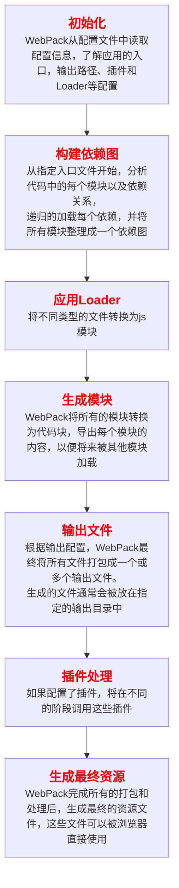
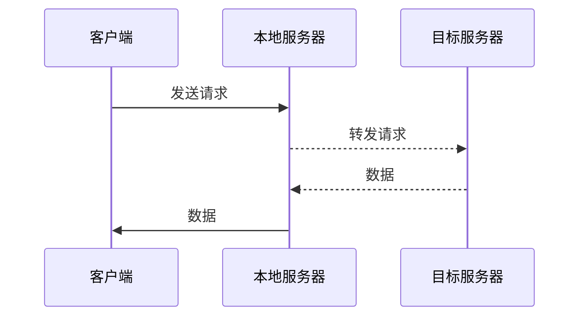

## 前端工程化
### 前端模块化的好处
前端模块化开发的好处有：
- **代码复用：** 模块化使得每个代码可以被多个项目或者组件复用，减少重复代码，提高开发效率；
- **维护性增强：** 将代码拆分成独立的模块，可以更容易的管理和维护。对某个模块的修改不会影响到其他模块，减少了潜在的影响；
- **团队协作：** 不同的开发者可以各自负责不同的模块，通过明确的接口来进行协作，提高团队工作的效率；
- **清晰的结构：** 模块化开发能够是项目结构更清晰，逻辑层次更分明，便于理解和上手；
- **测试便利：** 独立的模块可以单独进行单元测试，便于发现和修复问题，提高代码质量；
- **按需加载：** 模块化允许只加载需要的部分，减少受聘在家时间，提高用户体验；
- **版本控制：** 模块化方便对每个模块进行版本管理，利于追踪与回滚；
- **依赖管理：** 模块管理系统可以有效管理模块间的依赖关系，减少潜在的冲突，提高包的可移植性。
---
### WebPack的核心原理
WebPack是一个现代js应用程序的静态模块打包工具。核心原理为以下几个关键点：
- **模块：** 在WebPack中，一切都被视为模块，比如js文件、css文件、图片等，WebPack允许将这些不同类型的资源视作模块进行管理
- **入口：** WebPack的打包过程从指定的入口文件开始。这个入口文件可以是一个或多个js文件，也可以是其他类型的模块。WebPack将从入口文件全部依赖的模块开始，生成一个依赖图
- **依赖图：** WebPack通过入口文件分析所有依赖，构建一个完整的依赖图，包含应用所有模块机器之间的关系
- **加载器：** 因为WebPack将非js文件视作模块，因此需要对应的加载器，加载器在模块被加载之间对其进行转换
- **插件：** WebPack通过插件系统扩展自身功能。插件可以在打包的不同的阶段执行特定的任务，如优化打包结果、生成HTML文件、压缩代码等
- **输出：** WebPack将打包并生成一个或多个输出文件，输出文件的配置可以在WebPack配置文件中指定
- **热模块替换：** WebPack还支持热模块替换功能，允许在不刷新页面的更新模块，提升开发体验

优势
1、它能进行模块打包，分析模块之间的依赖关系，将各种文件打包成一个或多个文件，减少浏览器请求次数，提升页面的加载速度；
2、支持CommonJS、AMD、ES6多种模块规范，方便开发者选择合适的规范开发；
3、通过loader机制可以处理各类文件；
4、代码分割和懒加载功能可将代码拆分为小块，按需加载，减少初始加载事件；
5、优化打包结果，压缩代码、去除无用代码……
6、丰富的插件生态，可以根据需要选择插件扩展功能

----
### 如何借助webpack优化前端性能
通过webpack优化前端的手段有：
- **js代码压缩：** `terser`是一个js解释、绞肉机、压缩机的工具集，可以帮助我们压缩、丑化我们的代码（丑化=变量/函数混淆+去掉格式空白、注释等，~~我不希望别人拿到我的代码可以直接使用~~），让`bundle`更小
- **css代码压缩：** css压缩通常是去除无用的空格等（因为很难改变选择器、属性的名称、值等
- **HTML代码压缩：** 使用`HtmlWebpackPlugin`插件来生成HTML的模块时，通过配置属性`minify`进行`html`化（设置了`minify`，实际上会使用另一个插件`html-minifier-terser`
- **文件大小压缩：** 减少`http`传输中的带宽损耗
- 图片压缩`
- **Tree Shaking：** 消除死代码，依赖于`ES Module`的静态语法分析（不执行任何代码，可以明确知道模块的依赖关系）
    - `usedExports`：通过标记某些函数是否被使用，之后通过terser进行优化
    - `sideEffects`：跳过整个文件/模块，直接查看该文件是否有副作用
- **代码分离：** 将代码分离到不同的`bundle`中，之后我们可以按需加载，或者并行加载这写文件
- **内联chunk：** 通过`InlineChunkHtmlPlugin`插件将一些`chunk`的模块内联到`html`

---
### WebPack打包流程

---
### 如何提高webpack打包的速度
- **缩小打包范围**
    - exclude/include：对babel-loader等明确include/exclude范围，减少不必要的解析
    - 合理配置entry：避免entry匹配太多文件，精确入口文件名
- **合理使用Loader：** 避免不必要的Loader，利用多进程/缓存
- **优化Plugins：** 分环境配置Plugins，避免不必要的开销
- **开启持久化缓存**
- **利用DllPlugin/DllReferencePlugin：** 对于大量不变的第三方库，可以用DllPlugin把他们打包成Dll文件，下次构建只需要打包自己的业务代码；
- **减少模块数量**
- **并行压缩**

减少打包范围，用缓存，多进程，分环境配置，长缓存
    
---   
### WebPack热更新的原理
WebPack热更新通过`webpack-dev-server`和`HotModuleReplacementPlugin`实现了在不刷新浏览的前提下更新页面，具体原理如下：
启动时，webpack编译代码，`HotModuleReplacementPlugin`为每个模块生成唯一ID，并注入热更新代码，`webpack-dev-server`启动并与浏览器建立`WebSocket`连接。当文件修改时，webpack重新编译变化的模块，`webpack-dev-server`通过`WebSokect`向浏览器发送更新消息。浏览器接收到消息后，请求更新的模块文件，热更新运行时根据模块ID替换旧模块，并调用相关方法进行清理和初始化。
模块替换根据模块依赖图递归进行，如果模块没有定义`accept`方法，会向上查找父模块。若到达入口模块仍无`accept`方法，热更新失败，浏览器全量更新。
开发者需要在模块中使用module.hot.accept()方法，显示声明该模块可以热更新
热更新≠自动刷新
    
---   
### 简述如何使用webpack-dev-server监控文件编译
1. **安装webpack和webpack-dev-server：** 使用`npm install webpack webpack-dev-server --save-dev`或`yarn add webpack webpack-dev-server --dev`进行安装；
2. **配置webpack.config.js：** 在文件的配置入口、输出和开发服务器选项，如`contentBase`、`compress`和`port`等；
3. **启动webpack-dev-server：** 在`package.js`的scripts中添加启动命令`"start":"webpack-dev-server --open"`，然后在终端运行`npm start`或`yarn start`
4. **监控与更新：**  启动后，webpack-dev-server会监控入口文件及其依赖文件的变化，自动触发重新编译。可通过配置热更新（HMR）提高开发效率，在配置文件中添加`hot:true`和`webpack.HotModuleReplacementPlugin`，并在入口文件中添加热更新支持代码

常见误区：依赖安装错误、配置错误和未启动服务器等

----
### webpack中的loader是什么
loader用于对模块的“源代码”进行转化，在`import`或者加载模块是预处理文件。
webpack仅能分析各种模块之间的依赖关系，然后形成资源列表，最终打包生成到指定的文件中，在webpack中任何文件都是模块，不仅仅是js文件，默认情况下，在遇到`import`或者`require`加载模块的时候，webpack只支持对js和json文件打包，对于css、sass、png等文件则需要loader对文件内容进行解析。
当webpack遇到无法识别的模块时，会在配置文件中查找该文件的解析规则。
**配置loader的三种方式：**
1、配置方式（推荐）：在`webpack.config.js`中指定指定loader；
2、内联方式：在每个`import`语句中显式的指定loader；
3、CLI方式：在`shell`命令中指定它们

**特性：**
1. loader支持链式调用，链中的每个loader会处理之前已经处理过的资源，最终变为js代码。（执行顺序与声明的顺序相反，先声明后执行）
2. loader可以是同步的，也可以是异步的；
3. loader运行在node.js中，并且可以执行任何操作；
4. 除了常见的通过`package.json`的main来将一个npm模块导出为一loader，还可以在`module.rules`中使用loader字段直接引用一个模块；
5. plugin可以未loader带来更多特性；
6. loader可以产生额外的任意文件

可以通过loader的与处理函数，为js生态系统提供更多能力。用户可以更加灵活的引入系颗粒度逻辑，如：压缩、打包、语言翻译和更多其他特性

**常见的loader**
`style-loader`：将css样式添加到DOM的内联样式标签style中
`css-loader`：允许将css文件通过require的方式引入，并返回css代码
`less/sass-loader`：处理less/sass
`postcss-loader`：用postcss来处理css
`file-loader`：分发文件到output目录并返回相对路径
`url-loader`：和file-loader类似，但是当文件小于设定的limit时可以返回一个Data Url
`html-minify-loader`：压缩HTML
`babel-loader`：用Babel来转化内ES6文件到ES

----
### plugin是什么，解决了什么问题
Plugin是一种计算机应用程序，它和主应用程序相互交互，以提供特定的功能（是一种遵循一定规范的应用程序接口编写出来的程序，只能运行在程序规定的系统下，因为其需要调用原纯净系统提供的函数库或者数据）
webpack中的plugin也是如此，plugin赋予其各种灵活的功能，例如：打包优化、资源管理、环境变量注入等，他们会运行在webpack不同阶段（钩子/生命周期），贯穿了webpack整个编译周期。

**目的在于解决loader无法实现的其他事**
loader只能做“文件级”的事情（如转码、解析样式、图片处理……
但一些“打包级”的需求，loader无能为力，如：压缩jscss资源、提取公共代码、提取css文件到单独文件、定义环境变量、提供热更新……

**工作原理**
webpack本身是基于**事件流机制**（Tapable实现的钩子系统）
Plugin会挂载在webpack的生命周期钩子上（比如emit、compile、done等）

plugin本质上：
- 是一个具有apply方法的js对象；
- 在apply方法里可以监听webpack生命周期中的事件
- 在对应的钩子里可以执行自定义的逻辑

**常见Plugin**
`html-webpack-plugin`：根据模板生成HTML文件，并自动引入打包后的资源
`clean-webpack-plugin`：打包前清理output目录
`mini-css-extract-plugin`：把css文件提取为独立文件
`webpack.DefinePlugin`：定义环境变量
`terser-webpack-plugin`：压缩js代码
`webpack.HotModuleReplacementPlugin`：实现热更新
`copy-webpack-plugin`：复制静态资源到打包目录
`BundleAnalyzerPlugin`：打包体积分析

----
### loader与Plugin的区别
Loaders
- **主要目的：** 主要在于转换文件。在webpack中，loaders用于处理应用程序中的模块，他们可以将某种类型的文件转换为js模块。
- **使用方式：** Loaders被应用于某种特定类型的文件（.css文件、.js文件……），通过指定文件的匹配规则，来处理这些文件。
- **执行时机：** Loaders在打包过程的抱起执行阶段，主要负责文件的解析和转换

Plugins
- **主要目的：** 主要是在打包的各个阶段进行更广泛的操作。可以做很多事情，包括优化打包结果、管理资源、修改输出内容、甚至是执行特定的建构流程；
- **使用方式：** 通常是全局匹配，适用于整个构建过程，而不是针对某个特定文件。可以设置多个插件来完成不同的任务；
- **执行时机：** 在构建生命周期的各个阶段执行，具有更大的灵活性和扩展性。

---
### webpack proxy的工作原理？为什么可以解决跨域？
#### 是什么？
`webpack proxy`是webpack提供的代理服务，基本行为就是接受客户端发送的请求后转发给其他服务器，其目的是为了便于开发者在开发模式下解决跨域问题，想要实现代理首先需要一个中间服务器，webpack中提供服务器的工具为`webpack-dev-server`
##### webpack-dev-server
`webpack-dev-server`是webpack官方推出的一款开发工具，将自动编译和自动刷新浏览器等一系列对开发友好的功能全部集成在了一起，目的是提高开发者日常的开发效率，**只适用于在开发阶段**
#### 工作原理
proxy工作原理实质上是利用`http-proxy-middleware`这个`http`代理中间件，实现请求转发给其他服务器。
当本地发送请求时，代理服务器相应该请求，并将请求转发到目标服务器，目标服务器响应数据后再将数据返回给代理服务器，最终再有代理服务器将数据响应给本地。在代理服务器传递数据给本地浏览器的过程中，两者同源，并不存在跨域行为，这时候浏览器就能正常接收数据

服务器于服务器之间请求数据不会存在跨域行为，跨域行为是浏览器安全策略限制
    
---
### 与webpack类似的工具还有哪些？区别？
- **Rollup:** ES modules打包器，与webpack非常相似，更加小巧
- **Parcel：** 是一款完全零配置的前端打包器，它提供了 “傻瓜式” 的使用体验，只需了解简单的命令，就能构建前端应用程序。Parcel 跟 Webpack 一样都支持以任意类型文件作为打包入口，但建议使用HTML文件作为入口，该HTML文件像平时一样正常编写代码、引用资源。
- **Snowpack：** 是一种闪电般快速的前端构建工具，专为现代Web设计，较复杂的打包工具（如Webpack或Parcel）的替代方案，利用JavaScript的本机模块系统，避免不必要的工作并保持流畅的开发体验
- **vite：** 是一种新型前端构建工具，能够显著提升前端开发体验
**它主要由两部分组成：**
    - 一个开发服务器，它基于 原生 ES 模块 提供了丰富的内建功能，如速度快到惊人的 模块热更新HMR
    - 一套构建指令，它使用 Rollup打包你的代码，并且它是预配置的，可以输出用于生产环境的优化过的静态资源

其作用类似`webpack`+`webpack-dev-server`，其特点有：快速的冷启动、即时的模块热更新、真正的按需编译

vite会直接启动开发服务器，不需要进行打包操作，也就意味着不需要分析模块的依赖、不需要编译，因此启动速度非常快。利用现代浏览器支持ES Module的特性，当浏览器请求某个模块的时候，再根据需要对模块的内容进行编译，这种方式大大缩短了编译时间    
