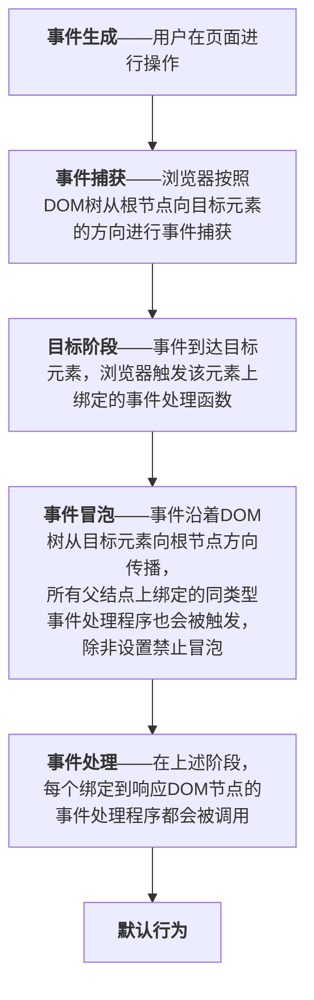

### 1、CSS选择器是如何在浏览器中解析和应用的？
CSS选择器在web浏览器中的解析和应用过程可以分为以下几个步骤：
**1.解析HTML文档**：构建一个DOM树（文档对象模型）DOM树是根据HTML元素的嵌套关系生成的树状结构；

**2.构建CSS规则树**：浏览器解析CSS样式表（包括内联样式、内部样式表，外部样式表）构建**CSS规则树**。在这个解析的过程中，浏览器会识别所有CSS选择器以及对应的样式结构

**3.选择器匹配**：当浏览需要为特定的DOM元素应用样式时，他会进行选择器匹配
> 遍历DOM树：浏览器从根节点遍历DOM树<br />针对每个节点：浏览器会检查每个CSS规则的选择器，看与当前节点是否匹配<br />匹配规则应用：如果选择器匹配该节点，则将该样式应用于该节点
<b>这个版本的性能消耗更大</b>
如果 ul li.active span{ color:red; }
从ul查找到span，需要遍历所有的子元素，因此选择器匹配规则是从“末梢”→“DOM树根”


**4.计算样式**：在选择器匹配完成后，浏览器会计算每个DOM节点的计算样式，包括通过继承、优先级和来源（内联、内部、外部样式）来确定最终样式

**5.渲染树**：计算的样式会被整合在一个渲染树中，渲染树中只包含那些需要被绘制的节点（e.g.可见的元素），同时会认为CSS的可见性（`display: none;`样式）已经处理过

**6.绘制**：浏览器将渲染树转换为屏幕中的实际像素，完成页面的视觉呈现

### 2、为什么需要浏览器缓存
核心：为了提升浏览器性能以及用户体验
**1.提高加载速度**：缓存可以存储静态资源（图片、Javascript文件、css文件），用户再次访问相同页面时，无需重新下载这些资源，从而加快页面加载速度；

**2.减少带宽消耗：** 通过使用缓存，浏览器无需从网上下载部分资源，从而降低浏览器对网络带宽的需求；

**3.改善用户体验：** 本地加载减少用户等待时间，优化用户体验；

**4.降低服务器负担：** 减少了对服务器的请求，提升整体的可用性和响应能力；

**5.支持离线访问：** 本地缓存使用户在没有网络连接的情况下仍然能够访问一些内容；

**6.避免重复请求：** 在使用浏览器时，重复请求相同的资源会造成不必要的延迟，缓存有助于避免这种情况。

### 3、什么是Cookie以及它在web开发中的作用
#### cookies是什么
**定义**：Cookie是由网站服务器创建的文本文件，存储在用户的浏览器中。每个Cookie都有一个名称、值、过期时间以及相关的域和路径

**大小限制**：单个cookie的大小通常在4KB左右，浏览器通常会限制每个域名可以存储的cookie数量

**生命周期**：cookies可以是会话cookie（在浏览器关闭时删除）或持久cookie（根据设定的过期时间保留）

#### 在web开发中的作用
**1.用户身份验证：** 可以存储用户的登录信息（例如身份验证令牌），用户无需重输账号和密码；

**2.会话管理：** Cookies可以跟踪用户会话，例如在购物网站中，以便用户将商品加入购物车并在会话中保持状态

**3.个性化设置&用户体验：** 网站可以使用Cookies来存储用户的偏好设置；

**4.跟踪分析**：可以用于分析用户行为，例如访问频率、点击行为等，帮助开发者优化网站的使用体验和功能；

**5.广告和营销：** Cookies广泛用于在线广告，以便识别用户并提供定制化的广告内容，或者进行再营销。

#### 注意事项
**1.隐私&合规性：** 由于Cookies可以收集用户数据，开发者应该遵循相关隐私法规（GDPR、CCPA……），并在适当的时候征求用户许可；

**2.安全性：** Cookies可能面临安全风险，例如跨站请求伪造（CSRF）和跨站脚本攻击（XSS）。应采取措施（如HTTPOnly和Secure标志）提高Cookie的安全性。

### 4、什么是Progress Web Apps（PWAs）？有什么好处
#### 什么是Progress Web Apps（PWAs）
PWAs是一种结合了传统网页和移动应用优点的Web应用程序，可以为用户提供一种类似本地应用的体验，三个要求：manifest、service worker、https

具备以下几个特点：
**1.离线功能：** PWAs可以在离线的模式下运行，用户即使没有网络也能使用应用；

**2.快速加载：** PWAs使用服务工作者技术（Service Workers），可以缓存资源，提供更快的加载速度，改善用户体验；

**3.跨平台兼容：** PWAs可以在不同的平台和设备上运行，包括桌面和移动设备，不需要为不同的操作系统开发不同的版本；

**4.安装性：** 用户可以将PWA“安装”到主屏幕，就像本地应用一样，提供便捷的访问方式，而不需要应用商店进行下载；

**5.自动更新：** 因为PWAs是基于web的，用户总是可以访问到最新版本，而不需要手动更新；

**6.安全性：** PWAs通常是运行在https环境中，确保数据传输的安全性。

#### 用户的好处
**提升体验：** PWAs提供了更加流畅的用户体验，接近本地应用的表现；
**节省空间：** 用户不需要下载和安装大型应用程序，节省设备存储空间；
**无缝访问：** 用户可以通过浏览器直接访问，无需通过应用商店下载和安装；
**跨平台一致性：** 不同设备上用户体验更加一致，增加了可访问性和便利性。

**总结：** PWA 是一种能像App一样使用的网页应用，结合了网页的轻量 &App的体验

#### service worker的工作原理和应用场景
service worker是一种在web浏览器中运行的脚本，可以在web应用与网络之间充当代理，提供更加高效的资源管理和离线功能。
**工作原理：**
**1、注册：** service worker需要通过js进行注册，与网页关联。在网页加载时自动完成；
**2、安装：** 注册结束后，浏览器会下载service worker脚本，并尝试安装，这个过程可以指定缓存静态资源，如HTML、css、js等；
**3、激活：** 安装成功后，service worker会被激活，进入“激活”状态；
**4、拦截请求：** service worker被激活后 按照自己的逻辑决定时从缓存中加载资源还是重新发起请求；
**5、缓存管理：** 使用cache API，service worker可以完成对静态资源的缓存和更新；
**6、后台同步与推送通知：** 支持后台同步与推送通知，能够在网络连接恢复后执行特定任务。

**应用场景：**
离线体验、性能优化、pwa、资源预缓存、动态内容管理、安全性


### 5、Web Workers是什么？解决了什么问题？
#### 是什么
是一种在浏览器中运行js代码的机制/是浏览器提供的一种多线程机制，在不阻塞主线程（UI页面）的情况下执行耗时的js任务

#### 解决的问题
**1.避免主线程阻塞：** js代码是单线程执行的，耗时的计算会导致页面无响应，使用web workers可以将这些计算移至后台，保证了用户界面的流畅性；

**2.并行处理：** web workers允许同时执行多个任务，从而提高应用程序的效率（e.g.处理数据请求、文件处理……

**3.提升性能：** 在进行数据密集型操作时，使用web workers可以显著提升应用的响应速度和性能；

**4.代码组织：** 将耗时的任务放在worker中，可以使代码更加清晰，主线程的逻辑更加专注于处理用户界面和交互；

**5.安全性：** web workers在一个独立的上下文中运行，都有自己的执行环境，不会直接访问DOM或者主线程中的全局变量，降低了可能引发的安全风险。

#### 与主线程的关系
**通信机制**：主线程与web workers之间通过postMessage()方法进行消息传递。主线程可以向web worker发送数据，web worker处理完数据后将结果返回给主线程
**独立性：** web worker独立于主线程运行，有自己的执行上下文和事件循环。这意味着它可以在主线程处理其他任务（响应用户交互、更新dom）的同事，在后台执行耗时的计算任务
**生命周期：** web worker的生命周期由主线程控制，主线程可以创建web worker也可以通过terminate()方法终止web worker的运行

#### 注意事项
**通信：** web workers与主线程之间通过postMessage进行通信，数据通过序列化传递；
**共享资源：** web workers不能直接访问DOM元素和一些全局变量（如windows对象），因此，如果需要更新页面，只能由web worker将结果返回给主线程，由主线程进行更新；
**限制：** 不同浏览器对于web workers的支持和实现可能存在差异，依赖于worker的某些特性需要考虑兼容性。Web worker脚本文件必须与主线程页面同源，（协议、域名、端口全部相同）

### 6、什么是WebSocket，与传统的HTTP通信相比有什么优势？
#### WebSocket是什么
是一种网络通信协议，旨在实现客户端（如web浏览器）和服务器之间全双工（双向）通信，与传统的HTTP通信不同，WebSocket允许在单个TCP连接上进行实时、双向数据交换

#### WebSocket的特点（相比之下的优势
**1.持久连接：** 与HTTP通信不同的是，WebSocket一旦建立连接，会保持开放的状态，允许持续的数据交换，无需像HTTP通信一样，每次请求都需要重新连接和携带额外的HTTP头，因此时延更低，资源开销更小
**2.全双工通信与实时性：** c/s可以同时发送和接收消息，因此能够实现数据的实时更新，而HTTP是请求-响应模型，s只能响应c的请求，WebSocket可以主动向c推送消息，交互性更好

### 7、什么是无障碍性（Accessibility
无障碍性在Web浏览器中指的是确保所有用户，包括身体、感官或认知障碍的人，都能平等地访问互联网内容和功能的特性。这包括对屏幕阅读器、键盘导航、色彩对比、字幕以及其他辅助技术的支持。
无障碍性不仅是为了符合标准或法规，更是为了创造一个更加包容的网络环境，使每个人都能享受到数字世界的好处。

### 8、DevTools中的“Performance”
浏览器DevTools中的“Performance”面板是一个强大的工具，旨在帮助开发者分析和优化网页的性能，提供了网页加载和运行时性能的详细信息，包括时间线、CPU占用、内存使用和其他关键的性能指标。
**1、记录和查看性能数据：**
- 记录网页加载过程和用户交互的性能数据（点击record开始/结束录制）
- 生成的性能报告会显示各种性能数据，including 帧率、cpu使用情况以及网络请求等

**2、时间线分析：** 以图形化的方式展示不同时间的持续时间，可以通过查看不同的颜色条快速了解哪些操作耗时较长
**3、标记和快照：** 可以标记特定的事件和快照，用于后续分析，比较不同的操作和页面状态
**4、堆栈跟踪：** 某些操作耗时较长时，可以点击相应的时间段查看回调和函数调用的信息，帮助识别性能瓶颈
5、重要指标：
- first contentful paint（fcp）：页面首次有内容呈现的时间
- largest contentful paint（lcp）：页面加载和主要内容可视的时间
- time to interactive（tti）：页面完全可以交互时间
- cumulative layout shift（cls）：页面布局稳定性

### 9、事件循环是什么？
浏览器的事件循环是一个重要的机制，用于处理异步事件和执行代码，是js代码运行是环境的核心部分，确保单线程的js可以高效地处理多个事件。
**如何工作：**
- 调用栈：js是单线程的，所有的代码执行都在调用栈中进行的，当一个函数被调用时，会被送到调用栈中，执行结束弹出栈
- webAPI：js代码可能会与web APIs进行交互，比如定时器、事件监听阿贾克斯请求等，这写调用会被送到webAPI环境，而不是立即执行
- 任务队列：webAPI完成其任务后，如定时器到期、网络请求完成，会将相应的回调函数送到任务队列中等待执行
- 事件循环：事件循环的核心是监控调用栈和任务队列，当调用栈为空时，就会从任务队列中取出一个回调函数，送到调用栈中执行

**流程：**
1. 执行代码函数调用进入调用栈
1. 遇到异步任务时，将其传递给web API进行处理
1. 异步任务完成，送到任务队列
1. 调用栈为空时，事件循环会从队头取出回调函数并执行
1. 重复上述步骤，直到所有任务完成

### 10、什么是混合内容？
混合内容是指一个使用HTTPS（安全超文本传输协议）的网站中，部分内容通过HTTP（超文本传输协议）加载的情况。具体来说，当一个HTTPS页面包含通过HTTP链接加载的资源（如图像、样式表、脚本……）时就会出现混合内容。

#### 两种类型：
1. 主动混合内容
只通过HTTP加载的资源将直接影响页面的行为，如js脚本，这种情况绝大多数其概况被当代浏览器是为不安全，会被阻止加载
2. 被动混合内容
指通过HTTP加载的资源不会直接影响页面的行为，如图像或视频，浏览器可能会发出警告，但不会阻止加载

#### 对网站安全的影响
1. 数据泄露：由于HTTP不加密，黑客可以窃听并篡改通过HTTP传输的数据，从而可能获取用户的敏感信息；
2. 安全威胁：主动混合内容可能被攻击者利用来注入恶意脚本，导致跨站XSS攻击等安全问题；
3. 信任问题：混合内容可能会导致用户对网站的信任度降低，影响用户体验与品牌形象；
4. SEO影响：搜索引擎可能会降低对包含混合内容的网站降低评分，影响网站在搜索结果中的排名

#### 解决方案
1. 全面使用HTTPS
2. 更新资源链接，将HTTP资源改为HTTPS链接，或者改用相对路径
3. 使用CSP（content security policy），实施内容安全策略限制不安全资源的加载

### 11、什么是跨域资源共享（cors)
跨域资源共享（cors：cross-origin-resource-sharing）是一种用于解决Web浏览器跨域请求限制的机制。默认情况下，浏览器遵循同源策略，即浏览器只允许同源（相同的协议、域名和端口）的网页资源进行交互，如API调用和数据请求，CORS允许服务器声明哪些外源可以访问它的资源，突破同源策略限制，从而实现跨域请求。
#### 重要性
**安全性——权限控制&跨域保护**
cors允许服务器定义那些外域可以访问其资源，保护资源不被恶意网站未经授权的访问或操作
**提高互操作性——前后端分离&跨域资源共享**
CORS的跨域资源共享不仅使得不同域之间可以安全的共享数据和API，提高web服务的互操作性，还使得前后端分离（前端应用和后端API可能位于不同域）成为可能。
**提升用户体验——无缝集成&减少错误**
通过允许跨域请求，前端应用可以与多个后端服务无缝集成，并且减少客户端错误，提升用户体验
#### 如何实现
**服务器端设置：**
`Access-Control-Allow-Origin`：指定允许访问资源的外域，可以设置具体域名或者`*`（表示允许所有域名）
`Access-Control-Allow-Methods`：定义允许的HTTP方法，如get、post……
`Access-Control-Allow-Headers`：指定允许的HTTP头
`Access-Control-Allow-Credentials`：指明是否允许发送凭据（如Cookie）值是true/false
**浏览器端**
浏览器自动处理CORS标准，在跨域请求时会根据cors规范进行检查和处理

<i><b>cors机制解决了现在web开发中常见的跨域数据访问问题，确保了安全性又保证了灵活性，使得web前后端的开发更加的安全</b></i>

### 12、区分DOM和BOM
#### DOM（文档对象模型）
**定义：** DOM是一个编程接口，允许脚本访问和更新文档的内容、样式和结构，以树状结构表示HTML或XML文档，文档的每一个部分都成为一个节点。
**功能：**
- **操作元素：** 可以动态的添加、删除、修改元素和内容
- **事件处理：** 可以为为元素添加事件监听器，以响应用户的操作（点击、输入
- **样式控制：** 通过js可以修改style样式

#### BOM（浏览器对象模型）
**定义：**BOM是一组对象，提供了与浏览器相关的功能，是脚本能够与浏览器环境进行交互，不专注于文档本身，而是提供了对浏览器窗口的控制。
**功能：**
- **窗口控制：** 通过window对象，可以实现对浏览器窗口的控制，如：打开、关闭、移动
- **地址栏操作：** 通过location对象，可以获取或改变URL，导航到不同的页面
- **定时器：** 使用setTimeout/setInterval管理时间相关行为
- **浏览器信息：** 通过navigator对象，可以获取有关浏览器和操作系统信息

### 13、如何提高浏览器页面的加载速度
**1、资源优化**
- 压缩资源：通过Gzip/Brotli等算法压缩HTML、CSS和js文件
- 压缩图片：选择合适的图片格式（webp），并使用压缩工具降低图片文件的大小

**2、懒加载**
- 图像懒加载：延迟加载图像或非关键资源，直到用户滚动到相应部分
- 异步加载脚本：采用`defer`或`async`属性加载js脚本，避免阻塞页面加载

**3、内容分发网络**
- 使用CDN将静态资源分发到里用户更近的服务器，提高加载速度


**4、浏览器缓存**
- 使用浏览器缓存策略，设置合适的HTTP缓存响应头，允许浏览器缓存静态资源，减少重复加载


**5、减少HTTP请求**
- 合并CSS和js文件，减少请求数量
- 使用CSS精灵（sprite）合并多张图片


**6、优化CSS和js**
- 移除不必要的代码，精简文件大小
- 使用CSS预处理器（less、scss）和构建工具（webpack）进行优化


**7、服务器优化**
- 配置服务器，使用HTTP/2，提高资源加载效率，选择合适的服务器结构，提升响应速度


**8、减少页面重定向：** 因为每次重定向都要增加加载时间
**9、使用请求合并：** 利用HTTP/2的多路复用特性，减少延迟
**10、监控和分析：** 使用工具监控网络性能，从而提升用户体验和网站的整体性能

减少请求、整合/压缩资源、资源缓存、优化服务器结构

### 14、浏览器的缓存机制
浏览器缓存是一种减少对的服务器的请求，从而提升页面加载速度的机制，分为强缓存和协商缓存
#### 强缓存&协商缓存
- 强缓存：浏览器直接从本地缓存、读取资源，无需向服务器发送请求
- 协商缓存：浏览器先向服务器发送一个请求，询问服务器该资源是否有更新。如果没有更新，服务器返回304状态码，浏览器使用本地缓存；如果更新，服务器返回新的资源。

#### 相关HTTP头字段
`Expires`：是一个HTTP1.0协议规定的字段，它的值是一个具体的时间，代表资源的过期时间
`Cache-Control`：是HTTP1.1协议规定的字段，有多种取值，如max-age表示资源的有效时间（秒）、no-cache表示使用协商缓存、no-store表示不使用任何缓存
`Etag`：是服务器为资源生成的唯一标识符，当资源发生变化时，ETag值也会发生变化
`Last-Modified`：表示资源最后修改时间

### 15、如何通过缓存机制提高页面加载速度
#### 利用强缓存
**设置Cache-control：** 在服务器端配置响应头，设置Cache-control的max-age值，对一些不经常改变的静态资源，可以设置较长的max-age，如`Cache-control：max-age=3600`，表示资源在一个小时内有效，浏览器在这一个小时内将直接使用本地资源，无需发送请求
**结合Expires：** 虽然Cache-control是HTTP1.1推荐的字段，但是为了兼容旧版本浏览器，可以同时设置Expires，但Cache-control的优先级更高

#### 利用协商缓存
**使用ETag：** 服务器在响应头中添加`ETag`字段，浏览器下次请求时会添加`If-None-Match`字段，其值为之前获取的`ETag`，服务器会对比自己的`ETag`和`If-None-Match`字段的值是否一致，一致则返回304状态码，否者返回新的资源。
**使用Last-modified：** 服务器在响应头中添加`Last-Modifie`d字段，浏览器会在下次请求时带上`If-Modified-Since`字段，其值为之前获取的`Last-Modified`，服务器比较请求头中的`If-Modified-Since`和当前资源的最后修改时间，一致则说明自上次请求后，资源没有更新，返回304状态码，否则发送新的资源。

当资源发生变化时，需要更新缓存，可以通过修改资源的文件名（添加版本号）来强制浏览器重新请求新的资源

### 16、web浏览器如何使用ES6模块化功能
1. 在HTML文件中使用`script`标签，指定`type`为`module`，这样浏览器会将js文件视为
2. js文件中：使用expor和import关键字到处导入模块中的内容。

```javaScript
//在math.js中
export function add(a,b)
	return a+b
}
//文件main.js中
import {add} from '../utils/math.js'
console.log(add(2+3))
```
**注意事项：**
- 文件扩展名：导入时需要使用完整的相对路径，包括`.js`扩展名
- cors问题：如果从不同的域加载模块，需要确保遵循同源策略，或适当设置CORS头
- 局部作用域：ES6模块由自己的作用域，模块的变量不会污染全局作用域
- 异步加载：模块是异步加载的，因此不能将模块内的代码放在`<script>`标签的回调中，外部模块的导入可能在主模块代码之前完成的。

### 17、HTTP/2与HTTP/1.1的主要区别
#### 背景知识
**HTTP/1.1：** 是广泛使用的HTTP协议版本，是文本协议，以明文形式储传输数据。它采用了请求-相应模型，一个TCP连接在同一时间只能处理一个请求，后续请求需要等待前一个请求完成。
**HTTP/2：** 是HTTP协议的下一个版本，旨在提高性能和效率，它是二进制协议，对数据进行二进制分帧处理，在一个TCP连接上可以处理多个请求和相应。

#### 对比
协议|  HTTP/1.1  | HTTP/2
---- |------------- | -------------
二进制分帧|基于文本格式，消息以明文形式传输，解析效率低并且容易出现歧义|将传输的信息分割为更小的帧，并采用二进制格式进行编码。帧包含了请求和响应的头部和数据，可以更高效的传输和处理数据，提高了解析的速度
多路复用|一个TCP连接上只能在同一时间处理一个网络请求，后续请求需要排队，如果前面的请求处理环面，会导致后续请求阻塞，即“队头阻塞”问题|允许一个TCP连接上同时发送多个请求和相应，不同的请求和响应可以交错传输，通过帧的优先级和流控制管理，提升了并发性能
头部压缩|请求和响应的头部信息以明文形式重复传输，即使大部分头部字段在多次请求中保持不变，会造成带宽的浪费|采用HPACK算法对头部信息进行压缩，他会建立一个静态、动态的索引表，对于重复的头部字段，只传输索引值，减少了头部数据的传输量，节约带宽
服务器推送|客户端要明确请求每个资源，服务器只能被动的响应请求|服务器可以主动向客户端推送资源
优先级|没有明确的优先级机制，按照请求的顺序进行处理|允许为每个流（请求/响应）设置优先级，服务器可以根据优先级来分配资源，提高了关键资源的加载速度。

### 18、浏览器扩展（extensions）和插件（plugins）的区别
他们是两种不同的技术，用于增强web浏览器的功能，在工作原理和用途上有所不同。

不同点|  扩展  |  插件  
-----|--------|--------
定义|扩展是用来增强浏览器功能的应用或者小程序，通常是通过前端三件套进行开发|插件是一种额外的软件组件，通常用于处理特定的内容类型（如音频）或提供特定的功能（如java/flash……
功能|修改浏览器用户界面、添加新功能或者改善用户的浏览体验（广告拦截、密码管理、主题更改……|插件允许浏览器支持某些多媒体内容或者更加复杂的应用程序（播放视频、动画或使用特定的文件格式
安全性|扩展通常在浏览器的安全沙箱中运行，并有权限请求机制，用户可以控制器访问级别|插件往往需要更高的访问权限，并且曾经被滥用，现代浏览器逐渐减少了对插件的支持，许多插件被认为有风险（如flash
安装|扩展一般通过浏览器的扩展商店进行安装|一般需要单独下载安装，并且可能伴随着较为麻烦的安装流程
支持|大多数现代浏览器都支持，并且扩展之间通常可以互相操作|随着web技术的发展，许多功能已经转移至H5等标准，减少了对插件的需求，许多现代浏览器已经停止了对插件的支持

### 19、CSS前缀（vendor prefixes）的用途和必要性
CSS前缀是由不同浏览器厂商提供的特定于浏览器的前缀，用于实验性或尚未成为标准的CSS特性。这些前缀通常由浏览器的开发团队在规范最终确定之前引入，为开发者提供了提前测试新特性的机会。
#### 主要用途
1. **兼容性：** 由于浏览器的实现可能不完全一致，一些新特性在各个浏览器中可能不被支持或实现效果不同，前缀确保了这些特性在不同浏览器中的兼容性；
2. **实验性功能：** 许多CSS特性在被正式标准化之前，会首先以带前缀的形式实现。开发者可以使用这些实验型功能，但需要注意这些功能支持情况可能会发生变化；
3. **回退支持：** 前缀可以让开发者为尚未支持该功能浏览器提供备用样式，在正式支持之前，而可以使用带前缀的属性实现相似的效果。
#### 常见前缀

`-webkit-`：用于WebKit引擎的浏览器，如chrome/safari

`-moz-`：用于mozilla的firefox浏览器

`-ms-`：用于Microsoft的IE/Edge浏览器

`-o-`：opera浏览器（早期版本

#### 必要性
**技术演进：** web技术在不断进步，许多新特性需要事件来成为标准，前缀为开发者提供了一个过渡期；
**用户体验：** 通过前缀功能，开发者可以为用户提供更好的体验，即便在浏览器的支持尚未完全支持的时候，并且不同浏览器在不同设别、地区国家会影响前缀的需求，确保跨浏览器的一致性保证了用户体验。

### 20、Web Storage API的用途和区别
Web Storage API是H5引入的一种机制，允许Web应用程序在用户的浏览器中存储数据，包括两种主要的存储机制：LacalStorage和SeesionStorage
**LocalStorage：** 用于长期存储数据，数据在浏览器关闭后仍然存在，除非明确删除；常用于保存用户偏好设置、主题选择等实时且需要持久化的信息
**SessionStorage:** 用户存储会话相关的信息，数据在浏览器标签页或窗口关闭时失效；常用于保存临时信息，例如表单数据、会话状态等

区别|LocalStorage|SessionStorage
----|------------|--------------|
生命周期|数据的有效期事无期的，只要不被删除将一直存在|数据只在当前会话有效，窗口或标签页被清空后数据被清空
存储容量|不同浏览器可能略有不同，但通常在5MB左右|同
作用域|数据在统一源的所有标签页和窗口共享|只在同一标签页或窗口下共享，不同标签页的SessionStorage是不同的
API和使用|都可以通过setItem(),getItem(),removeItem(),clear()方法进行存取和管理|同

### 21、浏览器隐私模式如何保护用户隐私
**正常浏览的隐私风险：**
1. 浏览器会记录用户的浏览历史、访问过的网站、搜索记录等信息，这些信息可能被网站、浏览器提供商收集并分析；
2. 网站使用Cookies和本地存储开保存用户的信息，以提供个性化服务，但是也可能被用于追踪用户行为；
3. 第三方广告商和追踪器可能会在网页中嵌入代码，手机用户浏览行为，用于精准投放广告

**隐私模式/无痕模式/隐身模式**
隐私模式从以下几个角度保护用户隐私：
1. **不保存浏览历史：** 在隐私模式下，浏览器不会保存用户的浏览历史、下载记录和表单填写记录，因此，关闭窗口后用户的活动不会被记录在浏览器的历史列表中；
2. **不存储Cookies：** 在隐私模式下，浏览器会限制或暂时不存储Cookies使网站无法追踪用户的访问行为，尤其对于广告公司来说，更难以追踪用户的个人信息；
3. **用户数据的临时存储：** 在隐私模式下，下载的文件会被保存至本地，但在会话结束后会话期间产生的数据（如Cookies和缓存）会被自动删除，这意味着其他用户无法查看隐私模式下的浏览活动；
4. **隔离会话：** 隐私模式创建了一个与常规会话隔离的环境，用户在隐私模式下访问的网页和内容不会与常规模式下的会话发生混淆；
5. **减少第三方跟踪：** 由于隐私模式不保留cookies，第三方追踪器（如广告网络）在用户关闭隐私窗口后将无法获取该会话的数据，从而减少了在线行为的追踪；
6. **保护共享设备上的隐私：** 在共享或公共设备上使用隐私模式时，用户可以更加安心的浏览网页，因为浏览历史和个人信息不会被其他用户看到。
**但是！！！隐私模式并不是完全匿名，互联网服务提供商（ISP）、网络管理员、已登录的网站和其他监控工具仍然可以监控用户的在线活动，如果需要完全的匿名环境，用户还需要使用其他隐私保护措施，如VPN/Tor等工具。**


### 22、浏览器的同源政策（Same-Origin Policy)
同源政策是web浏览器一项重要的安全机制，用于防止不同源之间的恶意交互
源=协议（如HTTP/HTTPS）+域名（如example.com）+端口（如80or403）
如果两个URL的这个三个部分完全相同，则被认为是同源，可互相访问和操作对方的资源

**同源政策的作用**

1. 防止跨站脚本攻击（XSS）：攻击者可以通过在受害者的浏览器中注入恶意脚本来崎岖用户的信息、会话标识符等，而同源政策能够阻止恶意脚本从不同源加载并执行；

2. 防止跨站请求伪造（CSRF）：通过限制不同源之间的请求，防止攻击者利用受害者已有的身份认证信息发起未授权的请求；

3. 保护用户隐私：确保未获得授权的网站无法获取用户在其他网站上的敏感信息，从而保护用户的隐私

4. 保障数据完整性：通过限制脚本访问其他源的数据，防止数据被篡改或窃取

**例外情况**
有一些可以实现跨源通信的方法：
1、CORS（跨域资源共享）：通过HTTP头部允许服务器声明哪些源可以访问其资源
2、JSONP：早期的技术允许跨域请求数据，已经不在推荐使用，在仍在一些遗留系统中出现
3、iframe与postMessage：允许在不同源之间进行安全的信息传递
4、预检请求：对于某些复杂的请求，浏览器会先发送一个OPTIONS请求，成为“预检请求”，以确定实际请求是否被允许；
5、代理服务器：设置一个同源服务器转发请求到目标服务器

### 23、HTTP与HTTPS的区别以及HTTPS的工作原理
这两种协议是用于Web浏览器和服务器之间通信的两种协议，主要区别是HTTPS比HTTP更安全
#### 二者区别
区别|HTTP|HTTPS
---|-----|----
协议类型|明文传输，数据在网络中明文形式进行传输，容易受到中间人的窃听与攻击|加密传输，数据在传输过程中会被i加密，难以窃听、篡改
端口|默认使用80端口|默认使用443端口
安全性|不提供安全验证，不保证数据的完整性和保密性|提供安全性，包括数据加密、身份验证和数据完整性校验
性能|由于无加密，性能相对较快|加密过程会增加一定性能开销
#### HTTPS工作原理
HTTPS的工作原理主要依赖于SSL/TLS协议，HTTPS工作流程如下：
1. 握手过程：当用户访问一个HTTPS网站是，浏览器首先与服务器建立连接，并进行SSL/TLS握手：
  - 客户端发送请求：浏览器向服务器发送请求，请求开始SSL/TLS连接
  - 服务器返回证书：服务器向浏览器发送器数字证书，包含公钥和一些相关信息
2. 证书验证：
  - 验证证书：客户端（浏览器）通过证书链验证服务器的数字证书，确保其是由可信的证书颁发机构（CA）签发的，以确保服务器身份
  - 建立安全通道：如果验证成功，客户端生成一个随机对称密钥，并用服务器的公钥对其进行加密，然后发给服务器
3. 加密通信
  - 对称密钥：一旦随机密钥被安全的交换，双方就可以使用这个密钥进行对称加密通信，保证数据的保密性和完整性
  - 数据传输：通过加密的连接开始传输数据
4. 连接关闭：当数据传输完毕后，双方可以关闭连接

### 24、HTTP请求的过程
web浏览器的HTTP请求分为以下几个主要步骤：DNS解析、TCP连接、请求发送、响应连接
**DNS解析**
1. 用户输入URL：用户在地址栏输入一个URL地址====》http://www.example.com
2. 提取域名：浏览器从URL中提取域名====》www.example.com
3. DNS查询：浏览器首先检查本地缓存，如果没有找到匹配的记录，则向DNS服务器发起域名解析请求，DNS服务器会进行递归查询，知道查找到相应的IP地址
4. 返回IP地址，DNS服务器返回域名对应的IP地址给浏览器

**TCP连接**
1. 三次握手——c：我要连接，s：允许链接，c：知道了
  - SYN：浏览器向服务器IP地址发起TCP连接请求（发送SYN包）
  - SYN-ACK：服务器收到请求后，回一个确认包（SYN-ACK），表示同意连接
  - ACK：浏览器再次发送确认包给服务器，完成三次握手，建立TCP连接
2. TCP连接成功

**请求发送**
1. 构建HTTP请求：浏览器根据请求的资源类型（GET、POST等）构建HTTP请求报文，包括请求行、请求头、请求体……
2. 发送HTTP请求：将构建好的HTTP请求通过已经建立的TCP连接发送到服务器

**响应接收：**
1. 服务器处理请求：服务器接收请求后，处理请求并生成相应，通常包括状态行，响应头、响应体
2. 发送HTTP响应：服务器将生成的HTTP响应通过TCP连接返回给浏览器
3. 浏览器接收响应：
  - 读取响应报文：浏览器读取服务器返回的响应，解析出响应状态、头信息和内容
  - 渲染页面：根据收到的HTML、CSS，js等资源进行页面渲染，显示给用户

**关闭连接**
根据HTTP协议的版本，TCP连接可能会保持一段时间（Keep-Alive）以便后续请求，或者在完成数据传输后主动关闭

### 25、AJAX和传统的web应用的区别
主要区别体现在通信方式和页面更新机制，传统web应用采用同步通信，每次请求都会导致页面刷新；而AJAX应用通过异步通信的方式实现局部更新，提升用户体验。AJAX应用通常前后端分析，服务器只负责提供数据，前端负责渲染和交互。

**传统web应用：**
每次用户操作（点击连接/提交表单……）都会导致整个页面重新加载或跳转，浏览器要重新发送请求，并在接收响应后重新渲染页面，导致页面卡顿用户体验不佳、服务器以及网络资源要求大。但是开发较为简单，易于调试
**AJAX：**
AJAX允许网页在不重新加载整个页面的情况与服务器交换数据，即页面可以局部更新，不干扰其他区域，网页更加流畅，用户体验更好，只传输必要数据，请求和响应的数据量通常较小。开发较为复杂，考虑异步请求、局部更新和浏览器兼容问题。

**AJAX的优缺点**

优点|缺点
----|----
异步通信，页面可以只更新局部内容，用户可以继续与页面进行交互，不会被刷新中断|SEO问题，AJAX生成的内容不一定能被搜索引擎抓取（很多引擎的爬虫无法执行js代码，导致部分内容无法被索引
提高用户体验，更快更流畅|浏览器兼容性，较老的浏览器不兼容AJAX
减少服务器负载，只需要请求传输必要数据|复杂性增加&调试困难
更高级的用户界面|安全问题，由于AJAX的动态性，可能会暴露更多接口和敏感数据，需要特别注意CSRF和XSS攻击
实时更新|**浏览器后退和书签问题**，由于AJAX动态更新内容，用户的后退按钮和书签功能可能无法按照预期工作，需要额外的逻辑处理维护URL状态

### 26、什么是XSS攻击
XSS攻击即Cross-Site-Script（跨站点攻击），攻击者通过在网页中注入恶意脚本，从而在用户浏览网页时偷偷执行这些代码，达到盗取信息、劫持操作等目的。

**常见的XSS类型：**

**反射性XSS：** 恶意代码在URL连接中，服务器没有过滤，服务器响应将恶意代码送回，即“反射”会页面上被执行通常用于钓鱼
**存储型XSS：** 恶意代码存储在数据库中，比如恶意留言、评论，一旦页面读取就会执行，**恶意最大**
**DOM型XSS：** 不通过服务器，前端JS操作DOM时直接注入，比如通过`innerHTML`渲染未加过滤的内容

**可能产生的攻击行为：**
盗取用户的cookies（登陆状态）；劫持用户会话（冒充用户）；操作页面内容（钓鱼）、强制跳转、弹广告、挖矿……

**如何防范：**
前端不要相信用户的输入，所有的输入的内容都要进行转义，避免直接使用`innerHTML`、`document.write`
后端对所有用户提交的数据进行过滤和编码，设置合适的HTTP头，采用白名单过滤机制

### 27、什么CSRF攻击

CSRF即Cross-Site Request Forgery（跨站请求伪造），在用户已经登陆的情况，发起一个用户没有意识到的恶意请求，比如在登录网银账号后，引导用户点击恶意链接，由于获取了用户的登陆身份，可以在用户不知情的情况下完成转账活动

用户是登录状态，被诱导发送请求（点击连接、访问恶意页面），致使服务器无法区分是用户自愿行为还是被伪造的，因为请求中包含了用户的登陆凭证

**服务器执行伪造请求，涉及到敏感操作，如转账、删数据**

#### 防御
由于CSRF伪造请求，因此为了预防CSRF核心在于让每一个请求都必须证明是由用户亲自发送的

**使用CSRF token**，每个表单请求都携带一个随机生成的token，这个token只存在于网页中，攻击者无法伪造，服务器接收请求时，校验token是否正确
**检查Referer/Origin头** 确认请求来源
使用SameSite cookies属性
对敏感操作进行二次确认
避免使用get请求执行敏感操作

### 28、其他web安全威胁
种类|原理|危害|方案措施
----|---|----|-------
SQL注入|攻击者通过在输入字段中注入恶意SQL语句，欺骗服务器执行非法数据库操作|窃取用户信息、修改/删除数据库数据、获取管理员权限|使用**参数化查询**，<br />不拼接SQL字符串，<br />对输入进行严格校验、转义，<br />设置数据库权限，避免使用root用户连接数据库
命令注入|攻击者注入系统命令，使服务器执行攻击者想要的命令|操作服务器系统文件，获取服务器控制权|不直接拼接用户输入到命令中，<br />使用白名单或参数校验，<br />使用系统库提供的安全API（如Node.js的execFile替代exc）
文件上传漏洞|攻击者恶意上传脚本，服务器未做校验即存储并执行|上传webshell，控制服务器，文件覆盖、信息泄露|限制上传文件的类型、大小、后缀，<br />存储上传文件时更改文件名，使其不具有执行权限，<br />存储在静态目录之外，<br />检查文件内容MIME类型
开放重定向|通过构造恶意跳转链接，让用户跳转到钓鱼网站|钓鱼攻击，用户信任被滥用|重定向地址通过白名单控制，<br />避免前端参数直接控制跳转地址
点击劫持|攻击者利用透明的iframe嵌套目标网站，诱导用户点击按钮/操作|误操作敏感按钮（转账），社交工程攻击|设置HTTP响应头，`X-Frame-Options: DENY` 或 `SAMEORIGIN`,<br />使用`Content-Security-Policy: frame-ancestors 'none'`

### 29、节流和防抖
节流和防抖都是前端性能优化中的概念，用来控制函数触发频率，尤其在一些高频事件中（scroll，resize，input……）
**防抖：** 等到事件停止触发后一段时间再执行函数
**节流：** 固定间隔时间触发一次
```javaScript
//防抖
function debounce(fn,delay){
	let timer = null
	return function(...arg){
		clearTimeout(timer)
		timer = setTimeout(()=>{
		fn.apply(this,args)
		},delay)
	}
}
```
```javaScript
//节流
function throttle(fn,interval){
	let lastTime = 0
	return function(...arg){
	const now = Date.now()
		clearTimeout(timer)
		if(now-lastTime>=Interval){
		lastTime = now
		fn.apply(this,arg)
		}
	}
}
```
### 30、如何减少回流和重绘

回流：浏览器需要重新计算元素的集合位置、尺寸等
重绘：只更新元素外观样式（颜色、背景等），相对回流更加轻量

**可以通过以下方式减少回流和重绘**

1. 避免频繁的DOM操作，采用文档片段（DocumentFragment）

2. 批量修改样式（合并DOM读写），对于一个DOM元素的样式修改可以通过添加类或者cssText的方式

3. 避免触发强制同步回流的属性
```javaScript
element.offsetHeight
element.offsetWidth
element.clientHeight
element.scrollTop
getComputedStyle(element).width
```
4. 在一些场景中使用`visibility:hidden`替代`display:none`，`display:none`元素不渲染，无法交互，在页面中不存在，因此重设display属性时会引发回流
> 如果只需要暂时隐藏元素（不影响布局），可以使用`visibility:hidden`或者`opacity:0`

5. 避免使用`table`布局或嵌套复杂DOM，因为`table`在渲染和尺寸计算上会引发 比普通块级布局更多的回流。复杂嵌套结构同理，尽量使用更现代的布局方式如`flex`，`grid`

6. 使用 will-change 提前声明动画区域（谨慎使用）这个属性会让浏览器为元素提前做准备，提升动画流畅度（如使用 GPU）。 但滥用会导致内存飙升，不要在太多元素上使用！

7. 使用transform和opacity做动画，他们不改变布局，因此不会触发回流。

### 31、什么是DocumentFragment，和直接操作DOM的区别是什么

DocumentFragment是一种轻量级的DOM容器，可以用来存储一组DOM节点，但是他本身并不属于DOM树的一部分，可以理解为一个“临时的、不显示的DOM仓库”，可以将DOM节点依次添加到DocumentFragment中，再一次性挂载到页面中，避免频繁操作真实DOM，避免重绘、回流。

### 32、事件委托的使用场景
当需要频繁绑定大量相同的事件，核心是利用事件冒泡机制（事件会触发点向上传播即冒泡到根节点，故而可以将事件监听器绑定在父级元素上，借由冒泡获取子元素的事件），将子元素的事件委托给父元素，从而减少事件绑定的次数，提高性能和管理性
注意事项：
确保事件可以冒泡
使用`e.target`或`e.delegateTarget`或`e.target.tagName`精准判断点击的元素
给父级加监听时注意限制触发条件，防止误触

### 33、Cookie、LocalStorage、SessionStorage区别

|区别| Cookies | LocalStorage | SessionStorage|
| --- | --- |-------|----|
| 存储大小 | 每个大小约4kb | 通常支持更大的存储空间，5-10MB，不同浏览器不同|通常支持更大的存储空间，5-10MB，不同浏览器不同|
|过期时间|可以设置过期时间，过期后会自动删除；如果没有设置过期时间，Cookie会在浏览器会话结束后被删除|数据永久保存，直到明确删除，除非用户手动清除浏览器数据|数据存储在页面会话中，关闭浏览器窗口/标签页后，数据会被清楚|
|作用域|可以在不同页面之间共享，基于域名和路径进行过滤|只能在同一域名下共享，不同的窗口和标签页可以访问相同的LocalStorage|只能在同一窗口或标签页中共享，不同标签页或窗口无法访问|
|用途|常用于验证用户身份、跟踪用户会话和存储不太大的服务器端数据|用于存储不需要的在服务器端验证的持久数据，比如用户首选项、主题设置等|存储会话的临时数据，例如表单数据，在用户导航不同页面时保持|
|请求发送|请求每次都会自动发送到服务器，可能会影响性能|不会自动发送到服务器，只在客户端存储和访问|不会自动发送到服务器，只在客户端存储和访问|

### 34、cookies有哪些字段

在Web浏览器中，Cookie是一种用于存储在用户设备上的小型文本数据，它们在客户端和服务器之间传递，用于管理状态和存储用户的偏好设置。
**Cookie 的常见字段及其作用包括：**
- Name：Cookie 的名称，唯一标识一个 Cookie。
- Value：Cookie 的值，与 Cookie 名称配对存储实际的数据内容。
- Domain：指定哪些域名可以访问该 Cookie。默认情况下，Cookie 仅对创建它的域名可用。
- Path：定义了 Cookie 可以被发送的 URL 路径。一般是某个目录，Cookie 只会在匹配这个路径的请求中被发送。
- Expires/Max-Age：指定 Cookie 的过期时间。Expires 是一个具体的日期和时间；Max-Age 是从创建 Cookie 到过期的秒数。如果没有设置，Cookie 是会话 Cookie，浏览器关闭时会失效。
- Secure：表示 Cookie 只能通过 HTTPS 协议传输。启用后，Cookie 在 HTTP 请求中不会被发送，从而提高安全性。
- HttpOnly：设置后只能通过 HTTP 请求访问 Cookie，从 JavaScript 中不能访问，增加了防止跨站脚本攻击（XSS）的安全性。
- SameSite：用于控制 Cookie 的跨站点请求行为。可以设置为 Lax、Strict 或 None。Strict 限制 Cookie 仅在同站请求中发送，Lax 允许部分跨站请求（如链接）；None 允许所有跨站请求，但需结合 Secure 一起使用。

### 35、CSS如何阻塞文档解析
浏览器在加载HTML文档时，会按照顺序解析HTML标签，构建DOM树，从HTML的开头开始，遇到不同的标签进行相应的处理。CSS资源时外部资源，或者`<style>`标签内的CSS代码时，会触发CSS的加载和解析。

具体来说，CSS会通过以下方式阻塞文档解析：
**1、样式表请求：**
浏览器在解析的过程中遇到`<link>`标签或者`<style>`标签时，如果CSS样式表是外部的（通过`<link>`引用）浏览器会停止解析HTML文档，去请求这个外部CSS文件
**2、阻塞特性**
外部样式表会被标记为**阻塞性**，这意味着浏览器在加载这些样式表时不会继续解释显示内容，这是为了保证页面的样式在绘制之前已经加载完成，防止出现样式闪烁（FOUC，flash of unstyled content）
**3、内联样式**
如果CSS样式是内联的（直接在`<style>`标签内），同样会造成阻塞，因为浏览器无法完全解析和渲染完整的HTML文档，直到执行完内联样式的解析
**4、样式优先级**
在解析CSS时，浏览器需要决定样式的优先级，这个过程也可能会减少其他内容的解析速度

综上，推荐将CSS放在文档的`<head>`部分

### 36、JavaScript如何阻塞浏览器解析
默认情况下，浏览器遇到`<script>`标签时，会立刻停止解析HTML，直到这个Javascript脚本加载并执行完毕之后才会解析后面的内容

避免阻塞行为的方法：
1、将`<script>`标签放在`</body>`之前
2、使用`defer`属性
- 会“异步下载”脚本
- 等待**HTML全部解析完后**再执行脚本（且是按照顺序执行的

3、使用`async`属性，下载完直接执行，不保证顺序

### 37、IndexedDB有哪些特点
IndexedDB是一种在Web浏览器中提供的低级API，用于在客户端存储大量结构化数据，主要特点如下：
1. 结构化数据存储
   IndexedDB支持复杂的数据类型，包括对象和二进制数据。使其比传统web存储（如local storage）更强大
2. 异步操作
   IndexedDB的操作是异步的，不会阻塞用户页面，用户在进行数据库操作的同时仍然可以与网页交互
3. 事务支持
   IndexedDB支持事务，允许在一组操作上组成一个原子操作，以确保一致性和完整性，这对于修改对象是非常重要的
4. 键值存储
   IndexedDB使用键值对进行数据存储，允许使用唯一的键快速检索数据
5. 索引
   IndexedDB支持创建索引，可以加快对数据的查询，特别是在需要根据特性的数据进行搜索时
6. 大数据处理
   IndexedDB可以处理更大的数据量，允许存储数百MB甚至几GB的数据
7. 版本控制
   IndexedDB具有版本控制功能，当需要更改数据库结构时，可以通过版本号管理数据库的更新与迁移
8. 跨源访问
   IndexedDB遵循同源策略，只有统一源的网页才能访问统一数据库，但可以通过特定的机制进行跨源或跨域访问
9. 浏览器支持
   受到现代浏览器广泛支持
10. 适应性强
    IndexedDB特别适合需要离线存储、网络延迟处理以及性能提升的应用。

**conclusion：**
在数据存储上，支持大容量存储和多种数据类型；采用事务机制，操作具有事务性且支持多版本并发控制；数据操作方面，支持索引和异步操作；安全性上支持同源策略；还具备离线支持且被现代主流浏览器广泛兼容。但是使用时要注意其异步操作特性，所有的操作应当在食物中进行，并遵循同源策略。

### 38、js的“执行上下文”以及“作用域链”
#### 执行上下文
执行上下文是js代码运行的环境，在js代码中，执行上下文有三种主要类型：
**1、全局执行上下文：** 这是代码执行的最初环境，浏览器在加载js文件时，会创建一个全局执行上下文。此时，所有的变量和函数都会被放在全局对象中（在浏览器中是window对象
**2、函数执行上下文：** 每当调用一个函数，js会为该函数创建一个新的执行上下文，每个函数的执行上下文包含以下信息：
- 变量对象：存储函数内部中的所有变量和参数
- 作用域链：包含了函数的作用域链以及外部所有作用域的引用
- this值：函数执行时的上下文对象

**3、Eval执行上下文：** 使用eval()函数时，会创建一个特定的执行上下文--->eval()可以将字符串作为js代码执行

#### 作用域链
作用域链是用于解析变量的机制，每个执行上下文都有一个作用域链，作用域链用于确定在执行上下文中可以访问哪些变量
- 作用域：定义了变量的可访问性，js中有两种作用域：全局作用域、局部作用域
- 作用域的工作原理：
  1. 当代码在某个执行上下文中执行时，js首先会查找该上下文的变量对象
  2. 如果找不到所需的变量，会沿着作用域链向外层的执行上下文查到，直到找到变量或者到达全局上下文
  3. 如果到达全局上下文认为找到，抛出`ReferenceError`

### 39、V8的垃圾回收机制
V8的垃圾回收机制采用**分代回收策略**，将内存分为新生代和老生代。
新生代采用Scavenge算法，把新生代内存分为from和to空间，新对象分配在From空间，满了就标记存活对象并复制到To空间，在清空From空间并交换二者角色。当对象满足年龄晋升或空间晋升条件时，会从新生代晋级到老生代
老生代采用**标记清除**和**标记整理算法**。标记清除先标记存活对象，再清除未标记对象，但会产生内存碎片；标记整理在标记清除基础上增加整理阶段，移动存活对象以解决内存碎片问题。
为减少对主线程的阻塞，V8还采用**增量标记**和**惰性清理技术**。增量标记将标记过程分成小步骤穿插在主线程执行中，惰性清理则在标记完成后不立即清理，在需要分配新内存时逐步清理。
垃圾回收不是实时的

### 40、事件与事件模型
在web浏览器中，**事件指用户与网页交互时发生的特定行为**。浏览器通过事件捕捉用户操作，从而触发相应的响应行为。

事件模型是指如何处理和响应事件的机制。
1. **事件类型：** 常见的事件类型有鼠标事件、键盘事件、触摸事件、表单事件、浏览器事件

2. **事件监听器：** 事件监听器是一个函数，在特定事件发生时被调用
```js
const button = document.querySelector('button')
button.addEventListener('click',function(){
    console.log('按钮被点击了')
})
```

3. **事件对象：** 事件发生时，浏览器会创建一个事件对象，包含该事件的信息（事件类型、目标元素、键盘按键的代码……），并将其传递给事件处理函数

4. **事件传播：** 事件在DOM中传递的三个阶段：捕获（从父元素查找到子元素）->目标元素->冒泡（从子元素返回到父元素）
事件的默认行为：一些事件存在默认行为，表单提交或链接跳转等，通过`event.preventDefault()`阻止默认行为

事件触发的过程：



### 41、什么情况会阻塞渲染

凡是浏览器在构建渲染树之间必须要等待完成的资源和操作，都可能造成阻塞渲染
e.g `<script>`标签，外部字体样式、大体积的CSS或者同步样式计算、DOM操作&大量的JS动画、图片或 iframe 的同步加载不会直接阻塞渲染主线程，但会影响用户体验和视觉完成度

### 42、什么是中间人攻击
中间人攻击（Man-in-the-middle，简称MITM）是一种网络攻击方式，通过各种技术手段将受入侵者控制的一台计算机虚拟放置在网络连接的两台通信计算机之间，这台计算机就被称为“中间人”
通过MITM能够窃取敏感信息、伪造身份、篡改通信信息、植入恶意代码

**常见的攻击方式**

|类型 | 描述|
|---|---|
|Wi-Fi劫持 | 在公共Wi-Fi下劫持数据|
|ARP欺骗 | 局域网中将自己伪装成网关或服务器|
|DNS欺骗 | 把域名解析结果改掉，引导用户访问伪造网站|
|SSL剥离 | 把 HTTPS 降级成 HTTP，从而读取明文数据|

**防御**

|方法 | 原理|
|---|---|
|使用 HTTPS | 数据加密，避免被窥视或篡改|
|证书验证 | 验证对方身份，防止伪造|
|开启 HSTS | 强制使用 HTTPS，不允许降级为 HTTP|
|避免使用公共 Wi-Fi 登录重要账户 | 无密码或伪造热点风险高|
|双因素认证（2FA） | 就算密码被盗，也更安全|
|客户端校验/签名机制 | 对数据进行完整性校验|

### 43、同步与异步的区别
**同步是阻塞模式** 某个进程执行某个请求时，若该请求需要一定的事件才能返回信息，则该进程将一直等待请求返回的信息，收到信息才会继续执行
**异步是非阻塞模式** 不等待请求返回的信息，继续执行接下的操作，当有消息返回时通知系统进行处理

|特性 | 同步（Sync） | 异步（Async）|
----|----|----|
|执行方式 | 顺序执行，等上一个完成再执行下一个 | 不等任务完成，先触发，稍后处理结果|
|是否阻塞线程 | 是（阻塞） | 否（非阻塞）|
|效率 | 可能低（等待时间多） | 效率更高（可并发处理）|
|应用场景 | 简单逻辑、必须一步步来的任务 | 网络请求、定时器、文件操作等 IO 密集型任务|

### 44、哪些操作会导致内存泄漏
**内存泄漏：** web浏览器为每个页面分配一定的内存用于存储与页面相关的数据和对象，如果这些数据和对象不再使用时，浏览器的垃圾回收机制将尝试回收这些内存，如果一些操作阻止了垃圾回收，会造成内存泄漏。


**可能导致内存泄漏的几种操作**

---

**1. 未解除的事件监听器**
如果为某些DOM元素添加事件监听器，但是不再需要这些元素时没有移除监听器，浏览器会保存这些元素的引用，从而导致无法被回收

**2. 全局变量**
如果在全局范围内意外创建了变量，这些变量将一直存在于内存中，直到页面关闭，因此会导致内存占用增加

**3. 闭包中的引用**
使用闭包可能导致对外部变量的引用持续存在，无法被垃圾回收，尤其在异步操作中

**4. 长生命周期定时器**
使用setTimeout/setInterval时，如果定时器不需要时没有清除，也会造成内存泄漏

**5. DOM引用**
如果对已经删除的DOM元素保持了引用===》循环引用，这些元素就没有办法被回收

**6. 大型数据结构**
保持对大型数据或对象的引用，而这些数据不再需要时，也会导致内存泄漏

**7. 第三方库和框架**
如果引入的第三方库本身存在内存泄漏问题，也会影响到整个应用

**8. Web Workers**
如果web workers仍在运行没有正确终止，将会导致内存增加

**9. 图片和媒体资源的引用**
动态加载的图片或媒体文件没有被正确释放或清除，浏览器会不断占用内存

### 45、如何优化关键渲染路径
#### 什么是关键渲染路径
关键渲染路径是指：浏览器从接收HTML、CSS和js等资源开始，到转化为屏幕上的像素所经历的一切步骤，主要包括解析HTML构建DOM树、解析CSS构建CSSOM树、合并CSSOM树和DOM树构建渲染树，布局计算元素位置和大小，绘制像素到屏幕等环节
#### 如何优化
**1、减少关键资源的数量**
可以将多个CSS文件合并为一个、多个JS文件合并为为一个来减少请求次数，对于非关键js代码，可以使用异步加载的方式避免阻塞渲染。
**2、压缩和优化关键资源**
对于HTML、CSS、JS文件进行压缩，去除其中不必要的字符，减少文件大小，加快下载速度；对于图片等资源使用合适的压缩工具和格式进行优化。
**3、优化CSS加载顺序**
确保关键CSS尽早加载，避免因CSS加载延迟导致的页面闪烁问题。可以将关键CSS内敛到HTML文件中，减少额外的请求；对于非关键的CSS，可以使用媒体查询来指定加载条件。
**4、优化js执行**
尽量减少内敛JS代码的执行时间，避免在首屏渲染前执行复杂的js逻辑；避免在js中频繁修改DOM和样式。
**5、使用服务端渲染（SSR）或静态站点生成（SSG）**
服务端渲染可以在服务器端生成完整的HTML页面然后将其发送给浏览器，减少浏览器在客户端构建DOM树的时间；静态站点生成是在构建阶段生成静态HTML文件，用户访问时直接返回这些文件，进一步提高页面加载速度。

### 46、如何优化动画
- 优先使用CSS动画，因为它是由浏览器渲染引擎直接处理，性能通常更好，且浏览器可以对其进行优化；
- 使用`will-change`属性，提前告知浏览器元素即将发生变化，让其提前优化；
- 减少重排和重绘，避免在动画中频繁修改会触发重排的属性，尽量使用`transform`和`opacity`属性；
- 如果使用js实现动画，应使用`requestAnimationFrame`，它与浏览器渲染周期同步，能避免不必要的渲染；
- 对动画中使用的图片和资源进行优化，减小文件大小；
- 对于复杂动画，使用分层处理，让浏览器独立的处理每个层的渲染。

### 47、如何实现浏览器内多个标签页之间的通信
浏览器的每个标签页通常是相互独立的执行环境，拥有自己的DOM、js执行上下文，需要特定的方式实现他们之间的数据交互

---
**1、Web Storage API**
使用lcoalStorage或者sessionStorage，结合Storage事件

<span style = 'color:red'><b>2、BroadcastChannel API</b></span>
专门用于标签页或窗口之间通信的API
```javascript
//在标签页A中
const channel = new BroadcastChannel('my_channel')
channel.postMessage('Hello from Tab A')

//在标签页B中监听
const channel = new BroadcastChannel('my_channel')
channel.onmessage = (e)=>{
    console.log(e.data)    //输出："Hello from Tab A"
}
```

**3、Service Workers**
如果使用了Service Worker，可以利用它来实现标签页之间的通信
```javaScript
//在service worker中接收消息
self.addEventListener('message',(e)=>{
    //处理数据
})

//在标签页中发送消息
navigator.serviceWorker.controller.postMessage('Hello from Tab A')
```
**4、WebSockets**
使用WebSockets可以在服务器和各个标签页间建立实时的双向通信，但需要后端支持

**5、Shared Worker**
shared worker允许多个浏览器上下文（标签页、iframe……）共享一个worker

### 48、简述内容安全策略

#### 是什么
内容安全策略（content security policy，CSP）是一种安全特性，通过限制网页可以加载的内容来源，帮助防止各种类型的攻击，including 跨站脚本攻击（xss）和数据注入。CSP是通过HTTP头部或者HTML中的`<meta>`标签定义的

#### 好处与作用
__1、防止XSS攻击:__ 通过限制允许执行的脚本来源，CSP可以有效阻止恶意脚本的执行；
**2、降低数据注入风险：** 限制能够被加载或执行的内容，减少了网站可能受到的注入攻击的风险；
**3、允许安全内容加载：** 能够指定安全的内容来源（如HTTP、特定的域），即使有恶意代码尝试插入，浏览器也会阻止不在CSP白名单当中的内容被加载；
**4、增强用户信任：** 通过实施CSP，可以提升用户对网站安全性的信任感。

#### 如何使用
1、设置CSP头，在服务器上配置HTTP响应头；
2、使用`<meta>`标签，如果不能在HTTP头设置CSP，可以在HTML文档中使用`<meta>`标签；
3、根据需要调整策略：根据网站的具体需求，调整策略，可以逐步增强策略，以确保在保证功能的同时不妨碍用户体验
4、报告机制：使用`report-uri`或`repor-to`指令设置报告机制，收集CSP违规报告；
5、逐步实施

### 49、什么是执行栈
执行栈（调用栈），是一个程序执行期间**用于管理函数调用**的栈结构。

<h4>工作原理</h4>

**1、函数调用：** 当一个函数被调用时，执行栈会创建一个新的栈帧（stack frame），这个栈帧包含了该函数的执行上下文、包括参数、局部变量、返回地址等信息；
**2、函数执行：** 函数执行时，当前的栈帧会被推入执行栈。函数执行完毕后，当前栈帧会被弹出，控制权返回到调用该函数的地方；
**3、错误处理：** 如果函数在执行过程中发生错误（引用错误、类型错误……），将会导致当前栈帧被丢弃，并且错误会传播到上层的栈帧。

#### 特点
**1、单线程：** js的执行环境是单线程的，同一时间只能执行同一个任务。当一个函数在执行时，其他函数必须等待，直到当前函数执行完毕并且从栈中弹出；
**2、后进先出。** 

### 50、什么是文档的预解析
文档的预解析在web浏览器中是一个优化过程，旨在提高页面加载速度和用户体验，包括：
**1、资源预加载：** 浏览器在渲染页面是，可以提前加载一些可能需要的资源（样式表、脚本、图像）。用户滚动或与页面交互时，这些资源已经在缓存中，提高了响应速度；
**2、DNS预解析：** 在用户请求某个页面时，浏览器可以在后台提前解析该页面中引用的外部资源的域名，可以减少DNS查询的时间，提高加载效率；
**3、连接预建立：** 对于一些在页面中频繁引用的外部资源，浏览器可以提前与服务器建立TCP连接（使用HTTP/2等技术可以复用连接），以减少后续请求的延迟
**4、关键资源优先加载：** 浏览器会根据文档流分析优先加载关键资源，比如首屏内容的CSS和js，从而加快页面首次渲染速度。

### 51、说说浏览器内核
浏览器内核是指浏览器中负责处理网页内容的核心组件，主要设计HTML、CSS、js等页面技术的解析和渲染。主要包括以下几个核心部分：

**1、解析器**
HTML解析器负责解析HTML文档，将其转化DOM树；CSS解析器解析CSS样式表并将其应用于DOM树，生成CSS规则树

**2、渲染引擎**
将DOM树与CSS规则树结合，生成渲染树，用于布局和绘制网页；处理页面的吧够，计算元素在屏幕上的位置、尺寸等属性

**3、Js引擎**
解析和执行js代码，允许网页实现动态功能，常见的js引擎包括Google的V8，Mozilla的SpiderMonkey

**4、事件处理**
处理用户交互（点击鼠标、键盘输入……），触发相应的js事件

**5、网络通信**
负责与服务器进行数据交换，处理HTTP/HTTPS请求与相应

**6、兼容性和安全性**
各浏览器内核实现标准的程度不同，，导致网页在不同浏览器中的显示效果可能不同；现在浏览器还要确保网页的安全性，防止跨站脚本攻击等安全隐患。
<hr>

**常见的内核** 
- webkit：最初由safari使用，后来也被chrome（早期）和一些其他浏览采纳；
- Blink：chrome的内核，是webkit的一个分支；
- Gecko：Mozilla Firefox使用的内核；
- EdgeHTML和Blink：分别对应老版的Edge和新版的Edge

### 52、如何确保网页在不同浏览器中的兼容性
- 遵循W3C标准，使用有效的标准化HTML/CSS，可使用验证工具（W3C Validator）
- 使用CSS重置或预设样式表，确保在不同浏览器中有一致的基础样式
- 利用功能检测库（如Modernizr）来判断浏览器支持的功能，并根据支持情况加载响应的代码
- 在CSS中为某些属性添加浏览器厂商前缀（-webkit-、-o-……）以提高兼容性
- 对于不支持某些新特性的老旧浏览器，使用`Polyfills`来模拟这些特性
- 使用媒体查询和相对单位（vh、vw）确保网页在不同设备和浏览器中都能良好显示
- 在不同浏览器、设备上进行测试，利用开发者工具查看网页性能表现
- 收集用户反馈，监控网页在不同浏览器上的表现，及时发现修复问题
- 使用跨浏览器的第三库和框架

### 53、不同浏览器中关于JS兼容性的两个常见问题
**1、Js引擎差异：** 各个浏览器使用不同的js引擎来解析和执行js代码，不同的引擎之间在处理某些js特性或新标准上可能会存在不一致；
**2、DOM API的实现差异：** 虽然DOM API是一个标准，但是在不同的浏览器中的实现可能有细微差异，如事件处理、样式和布局、API存在和行为

### 54、懒加载
懒加载的目的是在必要时才加载资源，而不是在页面加载的时候一次性记载所有内容，主要用于图像、视频以及其他媒体资源，以提高页面加载速度和用户体验。
#### 工作原理
**延迟加载：** 浏览器会在页面只加载可见区域内的资源，将其他未进入视口的资源延迟加载；
**滚动检测：** 当用户滚动页面时，浏览器会检测哪些资源即将进入视口，并在需要时加载这些资源
**占位符：** 在资源为加载之前，可以使用骨架屏或低分辨率图片来保留布局

#### 懒加载的优点
**加快页面加载速度**
**节省带宽：** 仅当用户真正访问内容时才加载相关资源，减少了不必要的数据消耗
**优化用户体验**

#### 实现方式
**原生HTML：** 使用`loading='lazy'`属性来实现懒加载
**Js：** 通过监听滚动事件，检测元素是否进入视口，实现懒加载
**第三方库：** 使用现成的库（如lazysizes）

#### 注意事项
实现懒加载时要保证SEO友好型不受影响，处理好资源的预加载和用户交互，保证用户在滚动时不会出现卡顿或延迟。

### 浏览器的渲染层合成是什么
渲染层合成是现代浏览器渲染流程中一个重要阶段，负责将页面中各个渲染层组合成最终的屏幕图像

**渲染层概念：**
在浏览器渲染页面是，会根据页面元素的属性和层级关系，将页面拆分为多个渲染层，每个渲染层可以看作是一个独立的绘图表面，包含一组相关的DOM元素。

**合成的过程：**
- 层的创建和管理：浏览器会根据页面元素的样式和位置信息，决定哪些元素会被提升到单独的渲染层，并为这些层分配单独的内存空间
- 层的绘制：每个渲染层会被单独绘制，生成对应的位图（Bitmap）
- 合成操作：浏览器按照所有渲染层的位图按照他们在页面中的层级关系进行合并，最终生成完整的屏幕图像，将其显示出来。

|正面影响|负面影响|
|---|---|
|提高页面的响应速度|内存消耗增加|
|优化动画性能|合成消耗增加|
|充分利用硬件加速|

### 点击刷新按钮、F5、ctrl+F5、地址栏回车有什么区别

|操作|行为|
|---|---|
|刷新按钮/F5|页面会重新加载当前内容，检查服务器中是否有更新的内容<br>如果没有更新内容，一般会加载缓存中的内容|
|Ctrl+F5（强制刷新）|浏览器忽略缓存，强制从服务器获取最新的页面和资源，重新下载所有元素|
|地址栏回车|检查缓存，根据缓存的策略进行判断，可能会从缓存加载，也有可能向服务器请求新的内容。<br>如果地址栏中输入的是当前页面的URL，效果与F5类似，但有时可能导致某些请求（如表单提交）以不同的方式进行处理|

### 网络劫持有哪些，如何防范
网络劫持是指恶意第三方通过各种手段，控制或干扰用户的网络连接，以窃取信息、插入广告、重定向流量等。
|类别|特点|防范方法|
|---|---|--|
|DNS劫持|恶意软件或攻击者修改DNS设置，将用户的请求重定向到伪造网站|使用可信的DNS服务器；定期检查和重设设备的DNS；设置使用VPN来加密DNS请求|
|HTTP劫持|攻击者通过中间人攻击，截取或窃取用户与网站之间的通信|确保使用HTTPS，通过SSL/TSL加密通信；使用可靠的VPN服务，以提供额外的加密层；避免在公用WIFI上进行敏感操作|
|插件或扩展劫持|恶意扩展程序可以修改浏览器行为，插入广告或劫持搜索结果|只安装来自官方商店的扩展程序；定期检查删除不必要的扩展；保持浏览器和扩展的最新版本|
|恶意软件感染|计算机感染恶意软件导致流量被劫持、信息被窃取|使用跟新的反病毒和反恶意软件工具进行定期扫描；注意下载来源，避免不安全的文件或软件|定期更新操作系统和应用程序|
|Cookie劫持|攻击者通过伪造、窃取用户cookie，获得对用户账户的控制|使用浏览器安全设置，设置cookie的使用；定期清理浏览器的cookie和缓存；启用“两步验证”保护重要账户|

<span style="color:red;">不能过度依赖安全软件，重视HTTPS协议的使用，谨慎选择网络环境</span>

### 预加载、预读取&预渲染的区别和用法

这三者是优化页面加载速度和用户体验的技术

**1、预加载**

**目的：** 为了**立即加载**和缓冲某些资源，以便在当前页面或即将到来的交互中使用
**用法：** 通常用于关键资源（css、js、字体……），使用`<link rel = 'preload'>`标签指定要预加载的资源

**2、预读取**

**目的：** 在用户可能**即将访问**的页面上提前加载资源，减少未来的加载时间
**用法：** 主要用于那些尚未被直接请求的资源，但用户很可能在不久的将来需要它们，使用`<link rel = 'prefetch'>`标签指定要预读取的资源

**3、预渲染**

**目的：** 预渲染是为了在后台完全渲染一个页面，使得用户在实际访问时几乎立即显示
**用法：** 是用与用户将要访问的页面，浏览器会在后台加载并渲染该页面的HTML和资源。用户切换时可以瞬时看到页面，使用`<link rel = 'prerender'>`标签

### JSONP的工作原理
是早期解决跨域请求数据的一种手段，利用`<script>`标签可以跨域加载资源（js文件），让后端返回一端特定格式的js代码，通过回调函数将数据传回来

与ajax相比：jsonp只能发送get请求，依赖于后端返回的特定格式的js代码

### Web Assembly是什么

是一个可以在网页中运行的**高性能二进制代码格式**，是一种能在浏览器中运行接近原生速度代码的技术

是一种低级字节码格式，可以在浏览器中运行，可以和js一起工作，可以把c/c++、rust、go等语言编译为`.wasm`文件，在浏览器中执行，目的是为了让web有更高的性能，尤其适合大型应用

不能替代所有JS操作（如DOM操作）、不适合简单交互逻辑、没有js灵活快速
